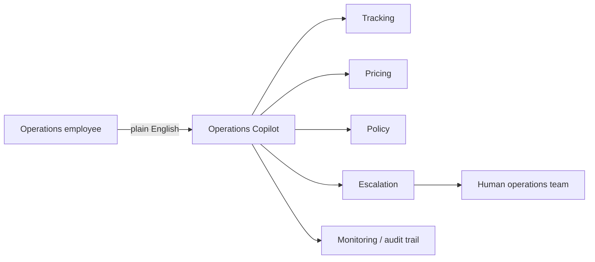
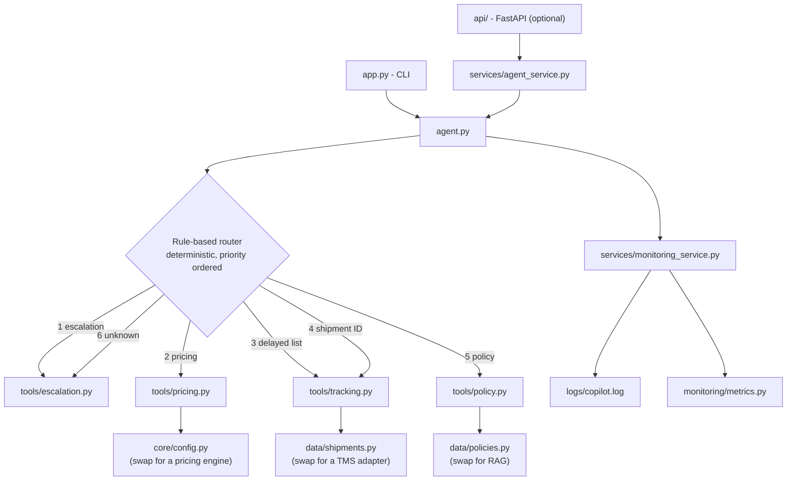
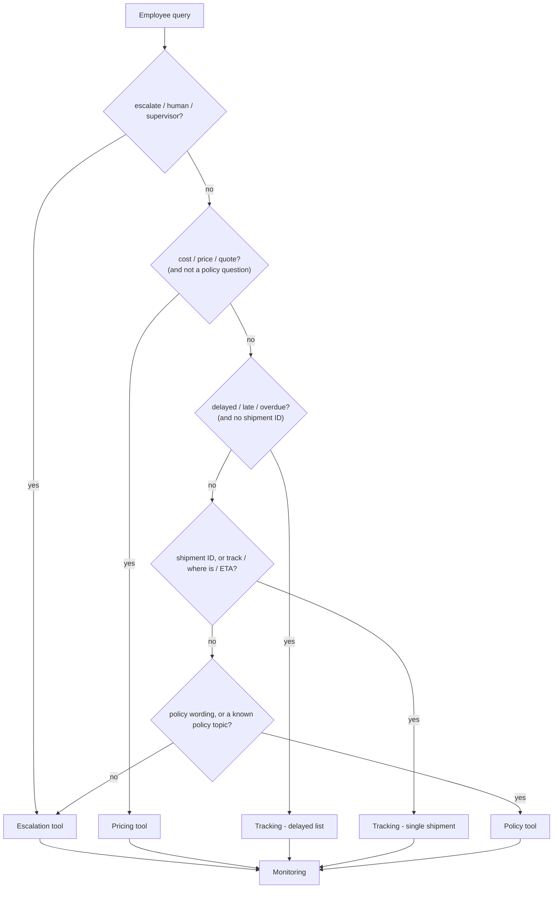
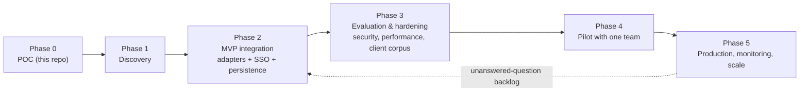

# Logistics Operations Copilot
### Project SETU-LOG — *Single Entry To Unified Logistics operations*
**Forward Deployment Engineer assignment - Task 4 (`fde-logistics-copilot-task-4`)**

A single natural-language interface that answers a logistics operations team's
five most repetitive questions - shipment tracking, delayed shipments, delivery
policies and delivery pricing - and hands anything it cannot answer safely to a
human.

This README is the walkthrough. The formal specification is
**[`docs/PRD.md`](docs/PRD.md)** — a 25-section Product Requirements Document
with 32 traced functional requirements, 12 non-functional requirements, a risk
register, an assumption register and acceptance criteria. Every claim below is
traceable to a section of it.

```bash
python app.py          # no API keys, no cloud, no database, no Docker
```

Built in two layers on purpose:

| Layer | What it is | How to check it |
|---|---|---|
| **Level 1 - working prototype** | The complete assignment, standard library only | `python app.py` |
| **Level 2 - production architecture** | REST API, schemas, service layer, tests, Docker, CI, and the design docs an FDE actually delivers | `pytest`, `uvicorn api.main:app`, `docs/` |

Level 2 never gets in Level 1's way: the prototype has **zero dependencies**,
and CI proves it on every commit by running the demo on a bare Python install.

### How to read the claims in this README

The PRD's evidence convention applies here too, because a reader should never
have to guess which numbers are real:

| Tag | Meaning |
|---|---|
| **`[MEASURED]`** | Produced by executing this build. `docs/PRD.md` Appendix E states how each figure was obtained. |
| **`[A-n]`** | A planning assumption about the client, **not** a supplied fact. All 16 are registered with a validation method in `docs/PRD.md` §23.2. |
| *(untagged)* | A property of the delivered code, checkable by reading the repository. |

Where this README and the code disagree, the code is correct and the README is
a defect.

---

## 1. Client scenario

A logistics company runs shipments across origin-destination lanes. Its
operations employees answer internal and customer questions all day, and the
answers live in different systems: a tracking system, a set of policy
documents, and a pricing source **`[A-2]`** **`[A-3]`**.

I have been deployed to this client as a Forward Deployment Engineer to build
an **Operations Copilot**.

The client here is an engagement scenario, so no operational metric, volume or
system name has been supplied by a real customer. Rather than invent them, the
PRD carries each as a tagged assumption with the discovery question that
retires it (`docs/PRD.md` §2, §23.2). That discipline is the point: an FDE who
presents assumptions as facts has already lost the engagement.

## 2. The client problem

Employees repeatedly need the same five kinds of information, and each one
lives somewhere else:

| Question | Where the answer lives today **`[A-2]`** | Cost of that |
|---|---|---|
| Where is shipment SH1024? | Tracking system / TMS | Context switch, login, search |
| Which shipments are delayed? | A report or a manual filter | Slow, easy to miss one |
| What is our delivery policy? | Documents + tribal knowledge **`[A-3]`** | Inconsistent answers between employees |
| What will this delivery cost? | Rate card / pricing tool **`[A-3]`** | Error-prone manual arithmetic |
| This case is unusual - who owns it? | Ad-hoc chat and email **`[A-4]`** | Escalations get lost |

The PRD decomposes this into five distinct problems (`docs/PRD.md` §3.2), and
the distinction matters because they need different fixes:

| # | Problem | What it actually is |
|---|---|---|
| 1 | **Navigation** | Answering starts with deciding *which system holds the answer*. That knowledge is tacit, so a new joiner is slow on questions a senior answers instantly — the gap is routing knowledge, not domain skill. |
| 2 | **Consistency** | Two operators consult sources of different vintage and answer differently. Where the answer reaches a customer, that is commercial exposure. |
| 3 | **Knowledge decay** | Policy lives in documents that change and memories that leave, and neither carries a version stamp at the point of use. |
| 4 | **Exceptions** | The questions that most need a human are the least likely to be recognised as such — an assistant optimised to be helpful answers them anyway. |
| 5 | **Invisibility** | With no record kept, nobody knows what the desk is asked most, or which questions recur because a policy is unclear. |

The copilot addresses 1 and 2 by routing deterministically, 3 by citing source
and version on every policy answer, 4 by escalating rather than guessing, and 5
by recording every interaction.

## 3. Business impact of solving it

- **Reduced manual lookup** - one question, one interface, no system-hopping. *(PRD goal G1)*
- **Faster operational response** - answers in one step instead of several. *(G1)*
- **Consistent policy answers** - the same question returns the same published policy, with its source and version. *(G2)*
- **Auditable pricing** - every quote itemised line by line, so an operator can justify it. *(G3)*
- **Safe human escalation** - anything uncertain goes to a person, with a reference, instead of being guessed. *(G4)*
- **An audit trail** - every query, tool, duration, outcome and response is recorded. *(G5)*
- **Less repetitive workload** - operators spend their time on exceptions, not lookups.
- **Zero-friction evaluation** - the client can run it before granting any access or credentials. *(G6)*

The eight business goals, each with a target and a measurement method, are in
`docs/PRD.md` §5.1. What is deliberately **not** claimed: any deflection rate,
time saving or cost-per-query figure. Those require a measured baseline that
does not exist yet, and are set jointly after discovery (`docs/PRD.md` §24.4).

## 4. What a Forward Deployment Engineer does

This repository is organised around the job, not just the code:

| # | FDE responsibility | Where it shows up here |
|---|---|---|
| 1 | Understand the business problem | §2 above; `docs/PRD.md` §2-§4 (context, problem decomposition, cost of inaction) |
| 2 | Communicate with client and engineering | `docs/PRD.md` §1-§9 for the business reader, §10-§19 for engineering, §20-§25 for delivery and acceptance |
| 3 | Identify data sources and data types | `docs/PRD.md` §10 (systems of record, corpora, data classification), `data/`, `client-customization.md` §3-4 |
| 4 | Translate business needs into requirements | `docs/PRD.md` — 25-section PRD: 32 traced functional requirements, 12 NFRs, risk register, assumption register, acceptance criteria |
| 5 | Build a POC/MVP on client data | This prototype, with a client-adapter seam (`docs/PRD.md` §13.4) |
| 6 | Design architecture at every level | `docs/HLD.md`, `docs/LLD.md`, `docs/api-design.md` |
| 7 | Address security and compliance | `docs/security.md`; `docs/PRD.md` §16 (threat model, RBAC matrix, control matrix) |
| 8 | Build benchmarks and evaluation | `tests/evaluation_dataset.py`, `docs/testing-evaluation.md`, `docs/PRD.md` §20 |
| 9 | Write code | `agent.py`, `tools/`, `api/`, `services/`, `core/` |
| 10 | Integrate with client systems | Adapter design, `client-customization.md` §2-5, §11-12 |
| 11 | Deploy | `Dockerfile`, `docker-compose.yml`, `.github/workflows/ci.yml`, `docs/production-readiness.md` |
| 12 | Monitor | `monitoring/`, `services/monitoring_service.py`, `logs/copilot.log` |
| 13 | Estimate cost and timeline | `docs/cost-estimation.md`; `docs/PRD.md` §21 (phases and schedule drivers), §22 (cost basis) |
| 14 | Solve it at scale, securely | `docs/HLD.md` §3, §8-9, `docs/production-readiness.md`, `docs/PRD.md` §12 (NFRs), §24 (acceptance) |

## 5. Requirement-to-solution mapping

Each assignment requirement is carried through the PRD as a numbered functional
requirement, implemented in a named module, proven by a named test, and closed
by a POC acceptance criterion. The full register is `docs/PRD.md` §11.1 (32
requirements) and the acceptance table is §24.1.

| Assignment requirement | PRD FR | Implementation | Verified by | Accepted |
|---|---|---|---|---|
| Shipment Tracking Tool | FR-01 to FR-03 | `tools/tracking.py` - `track_shipment()` | `tests/test_tracking.py` | P1 |
| Delayed shipments | FR-04 | `tools/tracking.py` - `get_delayed_shipments()` | `tests/test_tracking.py` | P2 |
| Cost Calculator Tool | FR-05 to FR-08 | `tools/pricing.py` - `calculate_delivery_cost()` | `tests/test_pricing.py` | P3 |
| Policy Tool, >= 5 policies | FR-09 to FR-12 | `tools/policy.py` + `data/policies.py` (**7 policies**) | `tests/test_policy.py` | P4 |
| Escalation Tool returning `Escalated to Operations Team` | FR-13, FR-14 | `tools/escalation.py` - `escalate_issue()` | `tests/test_escalation.py` | P5 |
| Agent that decides which tool to use | FR-15 to FR-21 | `agent.py` - `handle_query()` | `tests/test_agent.py` | P6, P7 |
| Monitoring: query, tool, time, success, response | FR-22 to FR-25 | `services/monitoring_service.py` + `monitoring/metrics.py` -> `logs/copilot.log` | `tests/test_agent.py` | P8 |
| `client-customization.md` | — | 21-section guide at the repo root | Reviewed against `docs/PRD.md` §23.2 | P10 |
| Runs with `python app.py` | FR-26, FR-32 | `app.py`, standard library only | CI job `prototype-stdlib-only` | P9 |

All 12 POC acceptance criteria are met and were verified by execution
(`docs/PRD.md` §24.1) **`[MEASURED]`**.

## 6. The Operations Copilot



The copilot owns no operational truth. It retrieves, computes, explains, and
escalates - which is exactly what keeps it safe to put in front of an
operations team.

## 7. Architecture



Layers: `channel -> service -> agent -> tool -> data`. Dependencies point one
way only; nothing in `tools/` or `data/` knows the CLI, the API or the agent
exists. That is what makes a client swap an adapter change instead of a
rewrite. Full detail in `docs/HLD.md` and `docs/LLD.md`.

## 8. Tools

Each tool sits in a risk class that sets the ceiling on what it may do
(`docs/PRD.md` §9.3). The ceiling is a property of the class, never of the
router's confidence.

| Tool | Function | Class | Behaviour |
|---|---|---|---|
| **Tracking** | `track_shipment(shipment_id)` | C1 read | Normalises the ID (`sh-1024` -> `SH1024`), looks it up, returns status, origin, destination, ETA, carrier and last scan. Unknown IDs return a clean miss with the known IDs listed. |
| | `get_delayed_shipments()` | C1 read | Every shipment whose status is `Delayed`, with its delay reason. |
| **Pricing** | `calculate_delivery_cost(weight, distance, priority)` | C2 advisory | `(50 + weight x 10 + distance x 0.50) x multiplier`, multipliers `standard 1.0 / express 1.5 / urgent 2.0`. Returns an itemised breakdown so a quote can be justified. Rejects non-positive weight/distance and unknown priorities. |
| **Policy** | `get_policy(query)` | C3 published position | Deterministic keyword retrieval over 7 policies: delivery, delayed shipment, damaged shipment, refund, cancellation, insurance, priority shipping. Every answer cites its source document, owner and last-updated date. |
| **Escalation** | `escalate_issue(reason)` | C4 human only | Always responds with **`Escalated to Operations Team`**, plus a reference (`ESC-0001`), queue and reason. |

All four return the same result shape (`tools/base.py`), which is why one
monitoring path and one API envelope cover every tool. The success semantics
are defined explicitly — a clean miss counts as a failure, asking for a missing
input does not — so the monitoring numbers mean what a reader assumes they mean
(`docs/PRD.md` §14.3).

## 9. Agent decision flow



Two refinements beyond the plain priority list, both deliberate and both tested:

- **A shipment ID beats the delayed list** - "Is SH1003 delayed?" is a question about one shipment.
- **A policy question is never a quote** - "What is our priority shipping cost policy?" contains "cost", but stays with the policy tool.

The full rule table, in priority order with the firing condition for each, is
`docs/PRD.md` §14.2; the risk classes that cap what each route may do are §9.3.

**Why rule-based?** It is deterministic, explainable, instant, free and runs
offline - the right default for operations. The router is a swappable function
(`agent.set_router`), so an LLM router can replace it later without touching a
single tool, test or endpoint. `tests/test_agent.py` proves the seam with a
stub router.

## 10. Monitoring

Every query is recorded with exactly what the assignment requires:

| Field | Example |
|---|---|
| `timestamp` | `2026-08-31T17:02:56.905+00:00` |
| `query` | `Where is shipment SH1024?` |
| `intent` | `shipment_tracking` |
| `tool_selected` | `tracking` |
| `execution_time_ms` | `0.078` (measured with `time.perf_counter()`) |
| `success` | `true` |
| `response` | the exact text the employee saw |
| `error` | `null`, or the error message |

Records go to `logs/copilot.log` as one JSON object per line (greppable,
`jq`-parsable, shippable to any log platform) **and** to an in-process metrics
registry exposed as `stats` in the CLI and `GET /api/v1/metrics` in the API:
totals, success rate, per-tool and per-intent breakdown, mean/max/p95 latency.

The log directory is created automatically, and a read-only filesystem degrades
to console logging instead of crashing.

Production observability - logs, metrics and traces via Prometheus/Grafana,
CloudWatch, Datadog, Splunk or ELK - is designed in `docs/production-readiness.md` §8
and `docs/PRD.md` §19. The dashboard that matters most is **unanswered
questions**: it turns the copilot's own limitations into a prioritised
capability backlog (`docs/PRD.md` §19.3).

## 11. Prototype vs production

| Capability | Prototype (built) | Production (designed) | Arrives in |
|---|---|---|---|
| Shipment data | In-process records in `data/shipments.py` | TMS/WMS/ERP adapter + PostgreSQL read model | Phase 2 |
| Policy answers | Deterministic keyword retrieval, 7 policies | Documents -> chunking -> embeddings -> vector DB -> retrieval -> grounded LLM answer with citations | Phase 2 |
| Pricing | Transparent formula in `core/config.py` | Client pricing engine / rate card API | Phase 2 |
| Escalation | In-memory ticket + log record | ServiceNow / Zendesk / Jira / internal helpdesk, with idempotency | Phase 2 |
| Routing | Rule-based, deterministic | Rule-based; optionally an LLM router behind the same seam, admitted only by the evaluation gate | Phase 3 |
| Interface | CLI + optional local FastAPI | Web, Slack, Teams behind an API gateway | Phase 4 |
| Auth | None (local, offline POC) | Enterprise SSO (OAuth2/OIDC) + RBAC | Phase 2 |
| Storage | None (log file only) | PostgreSQL: `shipments`, `escalations`, `audit_logs` | Phase 2 |
| Monitoring | File log + in-process metrics | Central logs, metrics, traces, dashboards, alerts | Phase 2 |
| Deployment | `python app.py` | Container -> registry -> Kubernetes/ECS, HPA, health probes, rollback | Phase 2 |

Phases are defined in `docs/PRD.md` §6.3 and §21.1. Phase 0 — everything in the
"Prototype" column — is complete. Each later phase ends at a gate with evidence,
not at a date; §21.2 explains why no calendar commitment is offered before
discovery.

## 12. Security

The prototype ships with **no authentication on purpose**: it is a local,
offline POC with no persistent store, no real client data and no credentials.
Adding a login screen would be theatre, not security.

Implemented today: input validation at every entry point, non-root container,
no secrets in the repository, no outbound network calls, full audit logging,
and errors that never leak internals.

Designed for production in `docs/security.md`: TLS, encryption at rest, SSO,
RBAC, secrets management, PII redaction, retention, rate limiting, dependency
and image scanning - plus the AI-specific risks (prompt injection, data
leakage, hallucinated policy) that must be handled *before* any LLM ships.

`docs/PRD.md` §16 carries the same material in specification form: a 10-item
threat model with the POC's actual exposure per threat, the RBAC matrix by
role and tool, and a control matrix whose left-hand column is deliberately
honest about what a POC does and does not have.

## 13. Evaluation

Testing asks "does the code work?". Evaluation asks "does the agent choose and
answer correctly?". Both run in CI.

| Measure | Result | |
|---|---|---|
| Automated tests | **138 passing** (tools 56, agent 26, API 19, evaluation 37) | **`[MEASURED]`** |
| Evaluation corpus | **34 realistic queries**, routing accuracy **100%** | **`[MEASURED]`** |
| Agent latency (local, in-process, 1,020 queries) | mean **0.036 ms**, p95 **0.116 ms**, max **0.134 ms** | **`[MEASURED]`** |
| Unknown queries escalated instead of guessed | **100%** | **`[MEASURED]`** |

The corpus (`tests/evaluation_dataset.py`) covers all six intents — 8 tracking,
4 delayed-list, 6 pricing, 9 policy, 4 escalation, 3 out-of-scope — and includes
three cases built to trap the routing rules:

| Query | The trap | Correct behaviour |
|---|---|---|
| "Is SH1003 delayed?" | Contains a delay keyword, and the delayed-list rule has higher priority | Single-shipment tracking — an explicit ID defeats the list rule |
| "What is our priority shipping **cost** policy?" | Contains a pricing keyword | Policy — policy wording defeats the pricing rule |
| "What is the **delayed** shipment policy?" | Contains a delay keyword | Policy |

A routing change that breaks any of these fails CI. The corpus is the template
a client extends with their own phrasing (`client-customization.md` §18,
`docs/PRD.md` §20.5).

These are prototype figures over in-memory data. They bound the copilot's own
overhead, which is the only part of the budget it controls — in production the
client's system latency dominates entirely (`docs/PRD.md` §12.3). Full
breakdown and the LLM evaluation plan: `docs/testing-evaluation.md`,
`docs/PRD.md` §20.

## 14. Project structure

```
fde-logistics-copilot-task-4/
├── app.py                     # CLI entry point - python app.py
├── agent.py                   # intent detection, routing, execution, monitoring
├── README.md
├── client-customization.md    # what changes for another client (21 sections)
├── requirements.txt           # optional deps only - the prototype needs none
├── .env.example  .gitignore  ruff.toml  Dockerfile  .dockerignore  docker-compose.yml
│
├── tools/                     # one job each, uniform result contract
│   ├── base.py  tracking.py  pricing.py  policy.py  escalation.py
├── data/                      # prototype data + the client-adapter seam
│   ├── shipments.py  policies.py
├── api/                       # optional FastAPI production interface
│   ├── main.py  routes.py
├── models/schemas.py          # Pydantic request/response contracts
├── services/                  # agent_service.py, monitoring_service.py
├── core/                      # config.py, logging_config.py, exceptions.py
├── monitoring/metrics.py      # QueryRecord + metrics registry
├── tests/                     # 138 tests incl. the evaluation harness
│   ├── test_tracking.py  test_pricing.py  test_policy.py  test_escalation.py
│   ├── test_agent.py  test_api.py  test_evaluation.py  evaluation_dataset.py
├── docs/
│   ├── PRD.md                 # 25 sections: requirements, risks, assumptions, acceptance
│   ├── HLD.md  LLD.md  api-design.md
│   ├── security.md  testing-evaluation.md
│   ├── production-readiness.md  cost-estimation.md
├── logs/                      # copilot.log is written here
└── .github/workflows/ci.yml
```

## 15. Installation

Requires Python 3.10+.

```bash
git clone <repository-url>
cd fde-logistics-copilot-task-4

# The assignment prototype needs NOTHING installed:
python app.py

# Optional - for the REST API and the test suite:
python -m venv .venv && source .venv/bin/activate   # Windows: .venv\Scripts\activate
pip install -r requirements.txt
```

## 16. Running the CLI

```bash
python app.py                              # interactive copilot
python app.py --query "Where is shipment SH1024?"   # one-shot
python app.py --demo                       # the five demo queries + fallback
```

```
======================================================================
 Logistics Operations Copilot v1.0.0
 Client: Demo Logistics Pvt. Ltd.   |   Environment: local
======================================================================
 Ask an operations question in plain English.
 Try:
   - Where is shipment SH1024?
   - Which shipments are delayed?
   - What is our delivery policy?
   - Calculate delivery cost.
   - Escalate this issue.
 Type 'help' for commands, 'exit' to quit.
======================================================================

copilot>
```

CLI commands: `help`, `examples`, `stats` (live monitoring metrics), `log`,
`exit`.

## 17. Running the API

```bash
pip install -r requirements.txt
uvicorn api.main:app --reload
# Swagger UI: http://127.0.0.1:8000/docs
```

```bash
curl -X POST http://127.0.0.1:8000/api/v1/copilot/query \
     -H "Content-Type: application/json" \
     -d '{"query": "Where is shipment SH1024?"}'
```

| Method | Endpoint | Purpose |
|---|---|---|
| GET | `/health` | Liveness / readiness |
| POST | `/api/v1/copilot/query` | **Main endpoint** - natural language |
| GET | `/api/v1/shipments/delayed` | Delayed shipments |
| GET | `/api/v1/shipments/{shipment_id}` | Track one shipment |
| POST | `/api/v1/pricing/calculate` | Delivery cost breakdown |
| GET | `/api/v1/policies` · `/api/v1/policies/{name}` | Policies |
| POST · GET | `/api/v1/escalations` | Raise / list escalations |
| GET | `/api/v1/metrics` · `/api/v1/metrics/recent` | Monitoring |

Contract details, status codes and production hardening: `docs/api-design.md`.

### Running it in Docker

```bash
docker build -t fde-logistics-copilot:1.0.0 .
docker run -p 8000:8000 fde-logistics-copilot:1.0.0        # API
docker run -it --rm fde-logistics-copilot:1.0.0 python app.py   # CLI in the same image
docker compose up --build                                   # API + host-mounted logs
```

Verified on this build: image 209 MB, runs as non-root `copilot` (uid 1000),
`HEALTHCHECK` reports **healthy**, all 138 tests pass inside the image, and
`logs/copilot.log` is written through to the host via the compose volume.

## 18. Demo queries

Actual output from this build (abbreviated):

**1. `Where is shipment SH1024?`** -> intent `shipment_tracking`, tool `tracking`
```
Shipment SH1024
  Status            : In Transit
  Origin            : Pune, IN
  Destination       : Jaipur, IN
  Estimated delivery: 2026-09-03
  Carrier           : VRL Surface
  Last scan         : In transit - Ahmedabad transit hub
```

**2. `Which shipments are delayed?`** -> intent `delayed_shipments`, tool `tracking`
```
2 delayed shipment(s) found:

Shipment SH1003
  Status            : Delayed
  Origin            : Chennai, IN
  Destination       : Hyderabad, IN
  Delay reason      : Vehicle breakdown at Chennai hub
...
```

**3. `What is our delivery policy?`** -> intent `policy_lookup`, tool `policy`
```
Standard Delivery Policy

Standard deliveries are completed within 3-5 business days for domestic lanes
and 7-10 business days for cross-border lanes. Delivery is attempted twice; ...

Source: OPS-POL-001 Standard Delivery Policy v4 | Owner: Operations | Last updated: 2026-06-01
```

**4. `Calculate delivery cost.`** -> intent `cost_calculation`, tool `pricing`
(the CLI then asks for weight, distance and priority; with `12.5 kg / 450 km / express`)
```
Delivery cost estimate (express):
  Base charge       : USD 50.00
  Weight charge     : USD 125.00 (12.5 kg x 10)
  Distance charge   : USD 225.00 (450 km x 0.5)
  Subtotal          : USD 400.00
  Priority multiplier: x1.5 (express)
  TOTAL             : USD 600.00
```

**5. `Escalate this issue.`** -> intent `escalation`, tool `escalation`
```
Escalated to Operations Team.
  Reference : ESC-0001
  Queue     : operations-team
  Reason    : Escalate this issue.
A human operations specialist will follow up on this request.
```

**6. Unknown question - `Book me a flight to Paris`** -> intent `unknown`, tool `escalation`
```
I could not match that request to shipment tracking, pricing or a published
policy, so I have handed it to a human.

Escalated to Operations Team.
  Reference : ESC-0002
  ...
```

## 19. Client customization

`client-customization.md` is the deployment playbook for the next logistics
customer: discovery, API integrations, TMS/WMS/ERP differences, schema mapping,
identifier formats, authentication, RBAC, pricing and business rules, policy
sources, RAG configuration, escalation workflow, helpdesk integration,
security and compliance, deployment environment, cloud vs on-prem, monitoring,
SLA, evaluation dataset, scaling, support model and cost model.

Its central claim, which the code is built to honour: **a new client should
change adapters and configuration, not the agent.**

Discovery is not open-ended: the 16 assumptions in `docs/PRD.md` §23.2 each
name the validation method that retires it, so "what do we need to find out?"
is already a written checklist before the first client workshop.

## 20. Production roadmap



Each phase ends at a gate with evidence, not at a date — the schedule is driven
by client-side dependencies that are not yet known, and a plan dated before
discovery is a guess presented as a commitment (`docs/PRD.md` §21.2). The ten
client-side dependencies, three of which sit on the critical path, are listed in
§21.3.

Phase definitions and exit gates: `docs/PRD.md` §6.3, §21.1. Deployment options,
health checks, autoscaling, rollback, backup and DR:
`docs/production-readiness.md`.

## 21. Success metrics

**Measured in this repository** **`[MEASURED]`**

| Metric | Result |
|---|---|
| Assignment requirements implemented | 9/9 |
| Functional requirements delivered and verified | 32/32 (`docs/PRD.md` §11.1) |
| POC acceptance criteria met | 12/12 (`docs/PRD.md` §24.1) |
| Tests passing | 138/138 |
| Routing accuracy on the evaluation corpus | 100% (34/34) |
| Escalations containing the exact required phrase | 100% |
| Unknown queries handed to a human | 100% |
| Unhandled exceptions reaching an operator | 0 |
| Dependencies needed to run `python app.py` | 0 |

**Deliberately not claimed here.** Deflection rate, time-to-answer reduction and
adoption are outcome metrics that require production traffic and a measured
baseline. `docs/PRD.md` §5.3 leaves those three rows unpopulated on purpose, and
§24.4 states plainly that no go-live figure for them will be offered before
discovery. A number invented now would only be discovered to be wrong later, by
the client.

## 22. Future improvements

1. **Client adapters** - TMS/WMS/ERP tracking, pricing engine, helpdesk escalation.
2. **RAG policy answers** - chunking, embeddings, vector store, grounded answers with citations.
3. **LLM router** behind the existing `set_router` seam, admitted only against the criteria in `docs/PRD.md` §15.5 — routing accuracy at or above the deterministic baseline, groundedness thresholds met, every prompt-injection case refused. The deterministic path stays as the fallback that makes adopting a model safe.
4. **SSO + RBAC** with regional and customer data scoping.
5. **PostgreSQL persistence** for audit logs, escalations and a shipment read model.
6. **More capabilities** driven by the "unanswered questions" dashboard - proof of delivery, carrier capacity, invoice status.
7. **More channels** - Slack and Teams, reusing the service layer unchanged.
8. **Proactive alerts** - notify an owner when a shipment slips its ETA, instead of waiting to be asked.

## 23. Notes for the reviewer

- `python app.py` runs the complete assignment with **no API keys, no cloud, no database and no Docker**.
- The mandated files are exactly where the assignment asks: `app.py`, `agent.py`, `tools/tracking.py`, `tools/pricing.py`, `tools/policy.py`, `tools/escalation.py`, `data/shipments.py`, `README.md`, `client-customization.md`.
- The escalation response contains the exact phrase `Escalated to Operations Team` (asserted in `tests/test_escalation.py` and grepped in CI).
- Everything claimed in this README was executed against this build; no performance number here is extrapolated or invented.
- Client-side figures are never presented as facts. All 16 are registered as assumptions with a validation method (`docs/PRD.md` §23.2), and no price or delivery date is quoted anywhere in the repository (§21.2, §22).

### Where to find what

| If you want to see... | Read |
|---|---|
| The working system, in five minutes | `python app.py --demo`, then §18 above |
| The formal specification | `docs/PRD.md` — 25 sections, 32 FRs, 12 NFRs, risk and assumption registers, acceptance criteria |
| How the pieces fit together | `docs/HLD.md` (architecture, database, auth, integration) |
| How the code actually works | `docs/LLD.md` (modules, routing rules, error handling, data flow) |
| The API contract | `docs/api-design.md`, or `/docs` on a running server |
| The security position | `docs/security.md`, `docs/PRD.md` §16 |
| How quality is proven | `docs/testing-evaluation.md`, `tests/evaluation_dataset.py`, `docs/PRD.md` §20 |
| How it reaches production | `docs/production-readiness.md`, `docs/PRD.md` §21 |
| What it would cost | `docs/cost-estimation.md`, `docs/PRD.md` §22 |
| What changes for the next client | `client-customization.md` — 21 sections |
