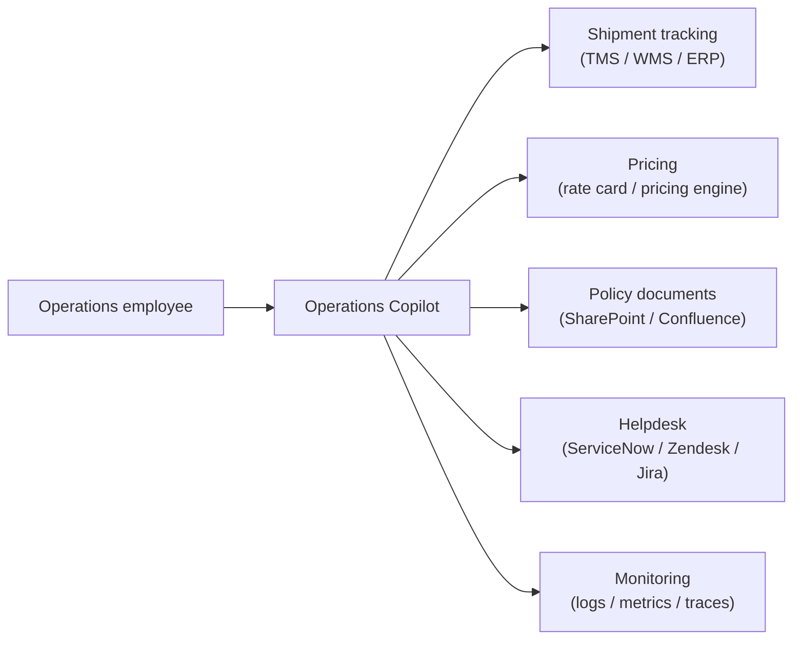
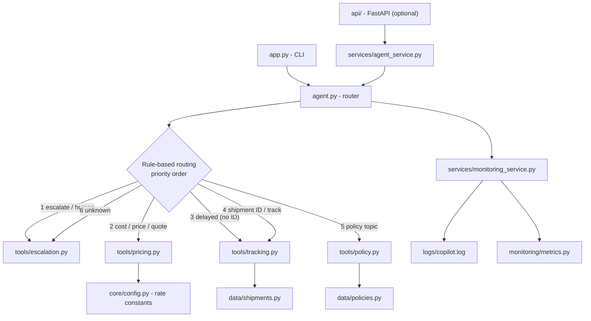
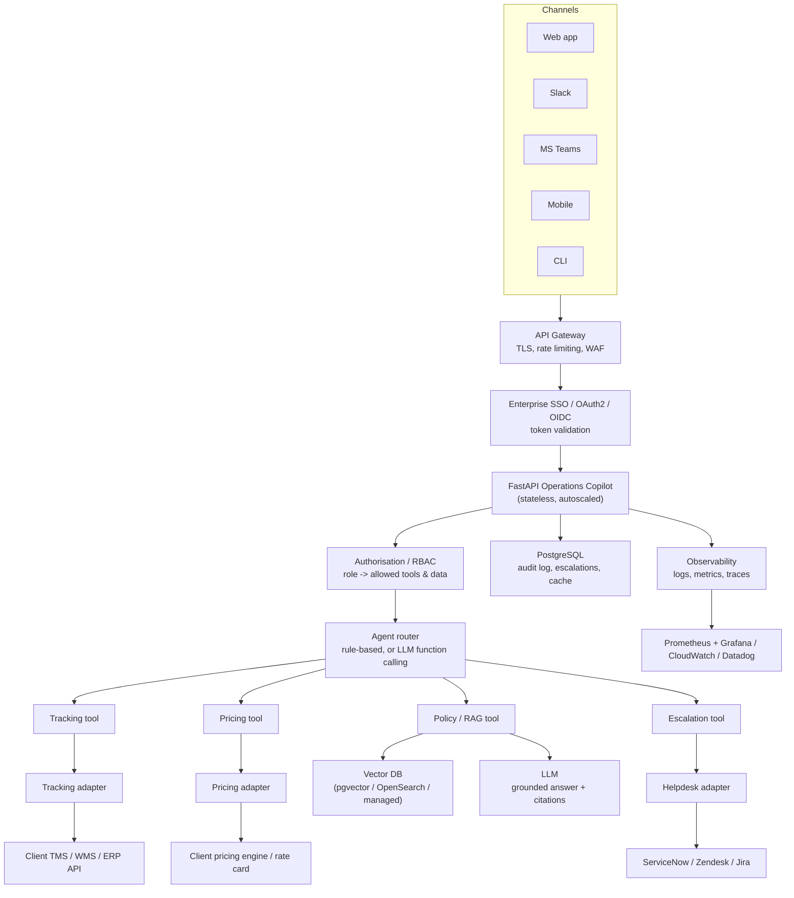
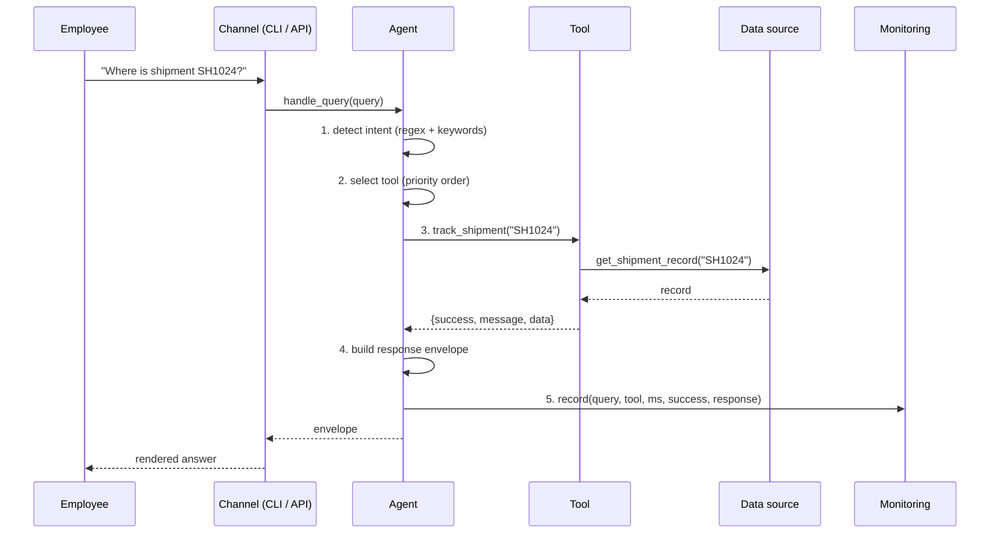
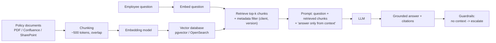
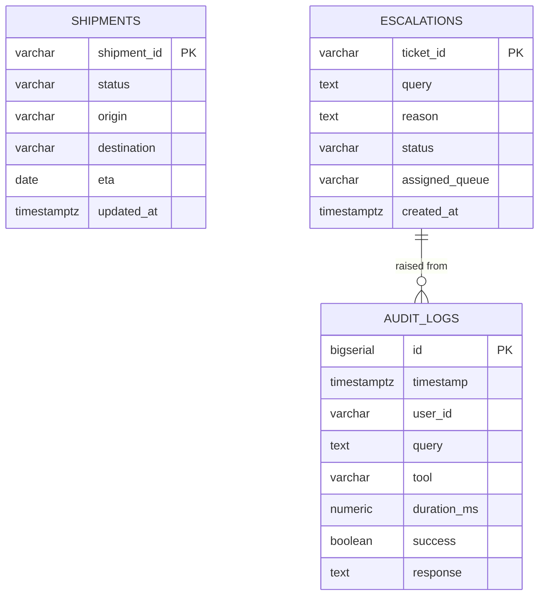
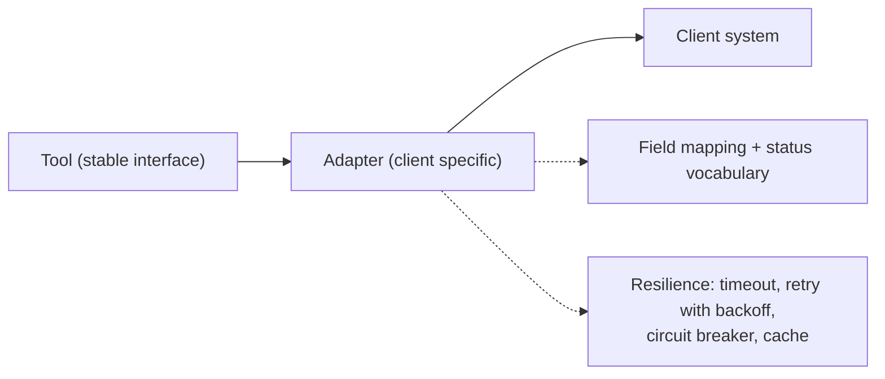
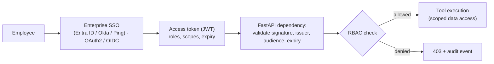
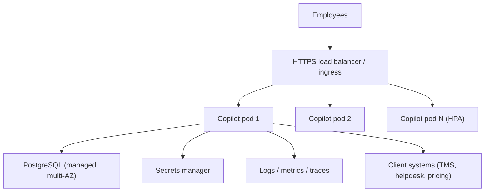

# High Level Design - Logistics Operations Copilot

This document describes the system in two layers:

* **Prototype (built)** - what runs today with `python app.py`.
* **Production (designed)** - the target architecture for a client deployment.

Nothing marked *designed* is claimed to be implemented.

---

## 1. Context

The copilot is a **thin intelligence layer over systems of record**. It owns no
operational truth: it retrieves, computes, explains and escalates.

## 2. Prototype architecture (what runs today)

Key property: **the CLI and the API share one agent, one set of tools and one
monitoring path**. A new channel is an adapter, never a fork of the logic.

## 3. Production architecture (designed)

### Layer responsibilities

| Layer | Responsibility | Prototype | Production |
|---|---|---|---|
| Channel | Capture the question, render the answer | CLI | Web, Slack, Teams, mobile |
| Gateway | TLS, rate limiting, WAF, routing | None | API Gateway / ingress |
| AuthN | Prove who the employee is | None | Enterprise SSO (OIDC), JWT validation |
| AuthZ | Decide what they may see or do | None | RBAC per role, per tool, per data scope |
| Agent | Choose the tool, explain the choice | Rule-based | Rule-based + optional LLM router |
| Tools | Do one job well | 4 tools, local data | Same 4 tools, client adapters |
| Data | Systems of record | In-process dicts | Client APIs, PostgreSQL, vector DB |
| Observability | Prove what happened | File log + in-process metrics | Central logs, metrics, traces, alerts |

## 4. Request flow

## 5. AI / LLM architecture (designed, not implemented)

The prototype answers policy questions with deterministic keyword retrieval.
The production path keeps the same tool boundary and upgrades what happens
inside it:

Two independent upgrades, each optional and each gated by evaluation:

1. **LLM router** - replaces `rule_based_router` via `agent.set_router()`. Same
   `RoutingDecision` contract, so tools, monitoring and tests are unaffected.
2. **RAG policy answers** - replaces keyword lookup inside `tools/policy.py`.

Guardrails that must ship with either upgrade: retrieval-grounded answers only,
citations shown, low-confidence -> escalate, prompt-injection filtering on
retrieved content, and no PII in prompts (docs/security.md).

## 6. Database architecture (designed, not required by the prototype)

The prototype persists nothing except the monitoring log. A production
deployment adds PostgreSQL:

| Table | Purpose | Notes |
|---|---|---|
| `shipments` | Read model / cache of tracking data | Source of truth stays the TMS; refreshed by sync or read-through cache |
| `escalations` | Local record of every escalation | Mirrors the helpdesk ticket id for reconciliation |
| `audit_logs` | One row per query - the monitoring requirement, durably | Partition by month; retention per client policy |

Indexes: `shipments(status)` for the delayed list, `audit_logs(timestamp)` and
`audit_logs(tool)` for dashboards, `escalations(status, created_at)`.

**Policy retrieval storage** - one option is PostgreSQL with the `pgvector`
extension, which keeps documents and embeddings in the database already being
operated. A managed vector service is equally valid. This is a client-by-client
choice, not a mandate.

## 7. Integration architecture

Every external system is reached through an adapter that owns authentication,
field mapping, status normalisation, timeouts, retries and caching. Tools stay
client-agnostic; onboarding a new client means writing adapters and mapping
configuration - not editing the agent. See client-customization.md.

## 8. Authentication and authorisation architecture (designed)

| Role | Tracking | Delayed list | Pricing | Policy | Escalation | Metrics / admin |
|---|---|---|---|---|---|---|
| Operations User | Own region's shipments | Yes | Standard quotes | Yes | Create | No |
| Supervisor | All shipments | Yes | All service levels | Yes | Create + close | Read |
| Administrator | All | Yes | All | Yes + edit sources | All | Full |

Enforcement points: token validation at the API edge, role check per endpoint
(FastAPI dependency), and data scoping inside the adapters so a user never
receives records outside their scope. Every allow and deny is audited.

## 9. Deployment view (designed)

The application is stateless: all state lives in PostgreSQL or the client's
systems, so horizontal scaling and rolling deployments are straightforward.
Container image -> registry -> Kubernetes or ECS. See docs/production-readiness.md.

## 10. Design decisions

| # | Decision | Why | Trade-off |
|---|---|---|---|
| D1 | Deterministic router by default | Explainable, testable, free, offline | Less flexible with unusual phrasing |
| D2 | Uniform tool result contract | One monitoring path, one API shape | Slightly more ceremony per tool |
| D3 | Data access behind functions, not raw dicts | Adapter swap without touching tools | One extra indirection in the POC |
| D4 | Unknown -> escalate, never guess | Safety in an operational context | Some answerable questions escalate |
| D5 | FastAPI layer optional | Grader runs `python app.py` with zero installs | Two entry points to keep in sync (mitigated by the shared service layer) |
| D6 | Pricing constants in config | Client rate changes are configuration | Real pricing still needs the client engine |
