# Low Level Design - Logistics Operations Copilot

Module-by-module description of what is actually implemented in this
repository. File paths and function signatures below match the code.

---

## 1. Module map

| Module | Responsibility | Depends on |
|---|---|---|
| `app.py` | CLI: banner, REPL, interactive pricing prompts, `--query` / `--demo` | `agent`, `core.config`, `services.monitoring_service` |
| `agent.py` | Intent detection, tool selection, execution, response envelope, monitoring | `tools/*`, `services.monitoring_service`, `core/*` |
| `tools/base.py` | Uniform tool result contract | - |
| `tools/tracking.py` | `track_shipment`, `get_delayed_shipments` | `data.shipments` |
| `tools/pricing.py` | `calculate_delivery_cost` | `core.config`, `core.exceptions` |
| `tools/policy.py` | `get_policy`, `find_policy` | `data.policies` |
| `tools/escalation.py` | `escalate_issue`, `list_escalations` | `core.config` |
| `data/shipments.py` | Prototype shipment records + accessors | - |
| `data/policies.py` | Prototype policy records + accessors | - |
| `core/config.py` | All tunables (paths, rates, patterns, API settings) | env vars |
| `core/exceptions.py` | `CopilotError`, `ValidationError`, ... | - |
| `core/logging_config.py` | Logger setup, log directory creation | `core.config` |
| `monitoring/metrics.py` | `QueryRecord`, `MetricsRegistry`, `metrics` singleton | - |
| `services/monitoring_service.py` | Record every query to log + metrics | `monitoring.metrics`, `core.logging_config` |
| `services/agent_service.py` | Channel-independent facade (NL + direct tool calls) | `agent`, `tools/*` |
| `api/main.py` | FastAPI app factory, `/health`, exception handlers | `api.routes`, `core/*` |
| `api/routes.py` | REST endpoints | `services.agent_service`, `models.schemas` |
| `models/schemas.py` | Pydantic request/response contracts | `core.config` |

Dependency direction is one-way: `channels -> services -> agent -> tools -> data`.
Nothing in `tools/` or `data/` imports the agent, the API or the CLI.

## 2. Tool result contract

Every tool returns the same dictionary (`tools/base.py`):

```python
{
    "tool":    "tracking",   # str  - which tool answered
    "success": True,         # bool - did it answer the question asked?
    "message": "Shipment ...",# str  - human readable answer
    "data":    {...} | None, # dict - structured payload for API/UI
}
```

`success` semantics:

| Situation | `success` | Why |
|---|---|---|
| Shipment found, policy matched, cost calculated, escalation raised | `True` | The question was answered |
| Shipment ID unknown, no policy matched | `False` | A real miss worth counting in monitoring |
| Pricing asked without weight/distance | `True` (with `data["needs_input"]`) | The copilot correctly asked for input |
| Invalid weight/distance/priority | raises `ValidationError` | Caught by the agent, reported as `success=False` |

## 3. `agent.py` in detail

### 3.1 Data structure

```python
@dataclass
class RoutingDecision:
    intent: str      # shipment_tracking | delayed_shipments | cost_calculation |
                     # policy_lookup | escalation | unknown
    tool: str        # tracking | pricing | policy | escalation
    reason: str      # human readable explanation of the decision
    params: dict     # extracted parameters (shipment_id, weight, distance, ...)
```

### 3.2 Routing rules (`rule_based_router`)

Evaluated in priority order; the first match wins.

| # | Intent | Fires when | Tool |
|---|---|---|---|
| 1 | `escalation` | any of: escalate, escalation, raise/open a ticket, human agent, talk/speak to a human, speak to someone, supervisor, manager, complaint | `escalation` |
| 2 | `cost_calculation` | a pricing keyword (cost, price, pricing, quote, charge, how much, rate, fee, tariff) **and** the query does not mention a policy | `pricing` |
| 3 | `delayed_shipments` | a delay keyword (delayed, delay, late, behind schedule, overdue, stuck), **no** policy mention, **and no** shipment ID in the text | `tracking` |
| 4 | `shipment_tracking` | a shipment ID is present, **or** a tracking keyword (track, where is, status of, locate, eta) with no policy mention | `tracking` |
| 5 | `policy_lookup` | the query mentions policy/rules/guideline/SOP, **or** it matches a published policy topic | `policy` |
| 6 | `unknown` | nothing matched | `escalation` |

Two refinements to the plain priority list, both deliberate:

* **Shipment ID beats the delayed list.** "Is SH1003 delayed?" asks about one
  shipment, so rule 3 stands down when an ID is present.
* **A policy question is never a quote.** "What is our priority shipping cost
  policy?" contains "cost", but the policy guard keeps it on rule 5.

### 3.3 Extraction

| Function | Pattern | Examples |
|---|---|---|
| `extract_shipment_id` | contextual regex (`shipment/awb/order` + id) then `COPILOT_SHIPMENT_ID_PATTERN` | `SH1024`, `sh-1003`, `shipment id: SH 1002` |
| `extract_pricing_params` | number + unit, or `weight/distance` + number, plus `standard\|express\|urgent` | `12.5 kg`, `450 km`, `weight of 8`, `express` |

Both normalise their output (uppercase, no separators, floats), so downstream
tools receive clean values.

### 3.4 `handle_query` pipeline

```python
def handle_query(query: str, context: dict | None = None) -> dict
```

1. Guard: empty query -> recorded, friendly prompt returned, `success=False`.
2. `detect_intent(query)` -> `RoutingDecision` (via the swappable router).
3. `_execute(decision, query, context)` runs the tool. `context` (supplied by a
   channel, e.g. the CLI's interactive pricing prompts) overrides values parsed
   from the text.
4. Response envelope is assembled.
5. `monitoring.record_query(...)` records the interaction.

Returned envelope:

```python
{
  "query": str, "intent": str, "tool_selected": str, "routing_reason": str,
  "success": bool, "response": str, "data": dict | None,
  "execution_time_ms": float, "error": str | None,
}
```

### 3.5 Router pluggability

```python
Router = Callable[[str], RoutingDecision]
agent.set_router(my_llm_router)   # tools, monitoring, API and tests unchanged
```

This is the single seam an LLM-based router needs. `tests/test_agent.py`
exercises it with a stub router to prove the seam works.

## 4. Error handling

| Layer | Failure | Behaviour |
|---|---|---|
| Tool | Invalid input | Raise `ValidationError` (also a `ValueError`) |
| Tool | Not found | Return `success=False` with a helpful message |
| Agent | `ValidationError` | Caught; `success=False`, message explains the fix |
| Agent | Any other `CopilotError` | Caught, logged, reported per tool |
| Agent | Unexpected `Exception` | Logged with traceback, auto-escalated to a human, never propagated to the user |
| API | `ValidationError` | HTTP 400 via exception handler |
| API | Not found | HTTP 404 with the tool's message |
| API | Bad payload | HTTP 422 from Pydantic before any logic runs |

Principle: **the copilot never crashes in front of an employee, and never
silently swallows a failure** - it degrades to a human handover and records why.

## 5. Monitoring implementation

`QueryRecord` (dataclass) captures exactly the required fields:

| Field | Source |
|---|---|
| `timestamp` | UTC ISO-8601, generated at record time |
| `query` | The employee's text (or an `[api] ...` label for direct endpoints) |
| `intent` | From the routing decision |
| `tool_selected` | From the routing decision |
| `execution_time_ms` | `time.perf_counter()` delta, rounded to 3 dp |
| `success` | From the tool result / error handling |
| `response` | Final text returned to the employee |
| `error` | Error string when one occurred, else `null` |

Each record goes to two sinks:

1. `logs/copilot.log` - one JSON object per line (newlines in the response are
   replaced with ` | ` and long responses truncated, so each record stays on one
   line and stays greppable).
2. `MetricsRegistry` - counters, per-tool and per-intent breakdowns, average /
   max / p95 latency, and a bounded ring buffer of the 200 most recent records.

Example log line:

```json
{"query": "Where is shipment SH1024?", "intent": "shipment_tracking",
 "tool_selected": "tracking", "execution_time_ms": 0.078, "success": true,
 "response": "Shipment SH1024 |   Status ...", "timestamp": "2026-08-31T17:02:56.905+00:00",
 "error": null}
```

The log directory is created on demand; if the filesystem is read-only the app
logs to console instead of failing (`core/logging_config.py`).

## 6. Data flow: "Where is shipment SH1024?"

```mermaid
flowchart LR
    Q["query string"] --> EX["extract_shipment_id -> 'SH1024'"]
    EX --> RD["RoutingDecision(shipment_tracking, tracking)"]
    RD --> TT["track_shipment('SH1024')"]
    TT --> NM["normalize_shipment_id"]
    NM --> DS["data.shipments.get_shipment_record"]
    DS --> FMT["_format_shipment -> message"]
    FMT --> ENV["response envelope"]
    ENV --> MON["monitoring.record_query"]
```



## 7. Configuration surface

Everything a deployment changes lives in `core/config.py`, all overridable by
environment variable (see `.env.example`):

| Group | Values |
|---|---|
| Identity | `APP_NAME`, `APP_VERSION`, `CLIENT_NAME`, `ENVIRONMENT` |
| Logging | `LOG_DIR`, `LOG_FILE`, `LOG_LEVEL` |
| Agent | `AGENT_MODE`, `SHIPMENT_ID_PATTERN` |
| Pricing | `BASE_CHARGE`, `WEIGHT_RATE_PER_KG`, `DISTANCE_RATE_PER_KM`, `PRIORITY_MULTIPLIERS`, `MAX_WEIGHT_KG`, `MAX_DISTANCE_KM`, `CURRENCY` |
| Escalation | `ESCALATION_PHRASE`, `ESCALATION_TICKET_PREFIX`, `ESCALATION_QUEUE` |
| API | `API_PREFIX`, `API_HOST`, `API_PORT`, `MAX_QUERY_LENGTH` |

`ESCALATION_PHRASE` is deliberately **not** environment-overridable in spirit -
it is an assignment contract, and `tests/test_escalation.py` asserts its value.

## 8. Extension recipes

**Add a tool** (e.g. carrier capacity lookup)

1. Create `tools/capacity.py` returning `tool_result(...)`.
2. Add an intent constant + keywords + a rule in `rule_based_router`.
3. Add a branch in `agent._execute`.
4. Add tests (`tests/test_capacity.py`) and evaluation queries.
5. Optionally expose `GET /api/v1/capacity/...`.

**Point tracking at a client system**

1. Implement `get_shipment_record` / `get_all_shipments` against the client API.
2. Map their status vocabulary onto the canonical statuses in `data/shipments.py`.
3. Everything else - tool, agent, CLI, API, tests - is unchanged.
