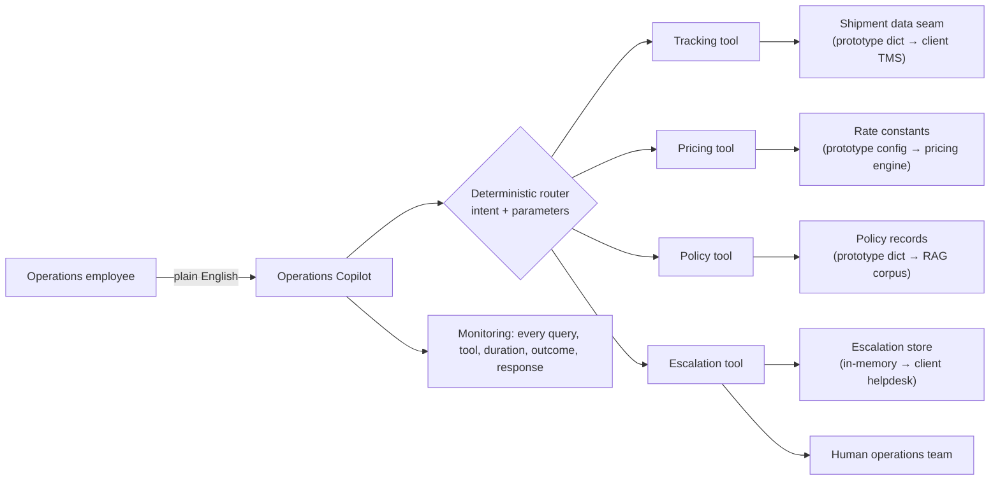
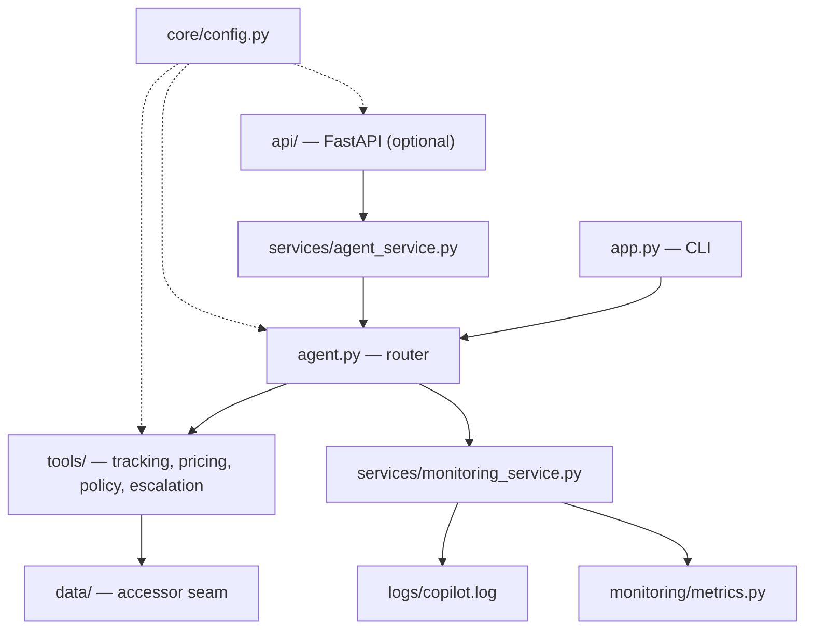
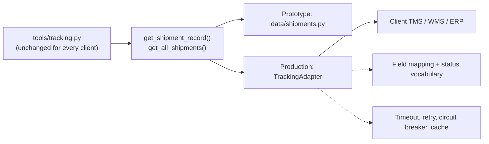
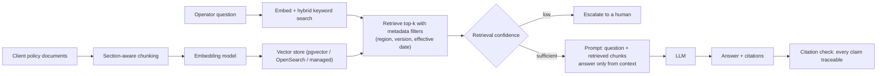
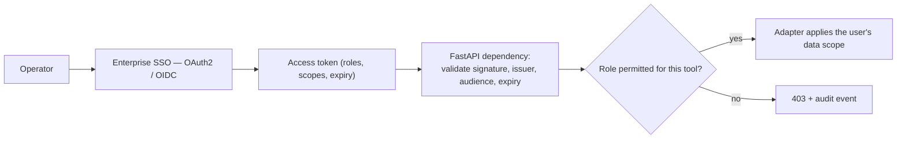

# FORWARD DEPLOYMENT ENGINEERING
### Logistics Operations Copilot

**PRODUCT REQUIREMENTS DOCUMENT**

## Project SETU-LOG
### Single Entry To Unified Logistics operations
**Agentic Operations Copilot for a Logistics Service Provider**

*Consolidating shipment tracking, delay management, policy guidance and delivery
pricing into one natural-language interface, with a human always behind it*

| Field | Detail |
|---|---|
| Document title | Logistics Operations Copilot — Product Requirements Document |
| Document reference | FDE/LOG/PRD/SETU-LOG/2026/v1.0 |
| Version | 1.0 (Baselined against the delivered prototype) |
| Date of issue | 31 August 2026 |
| Prepared by | Forward Deployment Engineering — Solution Architecture & Applied AI |
| Prepared for | Demo Logistics Pvt. Ltd. — Operations & Customer Experience |
| Engagement type | Forward Deployment Engineering assignment (Task 4) |
| Classification | Internal — Client Draft. Contains no client-confidential data. |
| Currency | All figures in US Dollars (USD), matching the prototype's `COPILOT_CURRENCY` default. Currency is configuration, not code. |
| Repository | `fde-logistics-copilot-task-4` — the working prototype this document specifies |

---

## Document Control and Approval

### Revision history

| Version | Date | Author | Summary of change | Status |
|---|---|---|---|---|
| 0.1 | 24 Aug 2026 | Forward Deployment Engineering | Initial skeleton from the engagement brief; problem statement and the five question types. | Draft |
| 0.4 | 27 Aug 2026 | Forward Deployment Engineering | Added tool decomposition, routing contract, data source inventory and the client-adapter seam. | Internal review |
| 0.7 | 29 Aug 2026 | Forward Deployment Engineering | Added evaluation corpus, monitoring specification, delivery phases and cost structure. | Internal review |
| 0.9 | 30 Aug 2026 | Forward Deployment Engineering | Added security control matrix, AI/LLM position, risk register and acceptance criteria. | Pre-approval |
| 1.0 | 31 Aug 2026 | Forward Deployment Engineering | Baselined against the delivered build; every measured figure re-verified by execution. | Approved |

### Approval

This document is issued by Forward Deployment Engineering and sets out the
scope, architecture, delivery approach and evaluation position for the Logistics
Operations Copilot. Approval signifies that the scope and architecture described
here represent the engineering position and may be relied upon for internal
evaluation, subject to the assumptions and exclusions recorded in Section 23.

| Role | Name | Organisation | Signature | Date |
|---|---|---|---|---|
| Author / Solution owner | Forward Deployment Engineer | Delivery team | — | 31 Aug 2026 |
| Technical reviewer | To be nominated | Engineering | | |
| Client reviewer | To be nominated | Demo Logistics — Operations | | |
| Client reviewer | To be nominated | Demo Logistics — IT & Security | | |
| Client approver | To be nominated | Demo Logistics — Sponsor | | |

### How to read this document

Sections 1 to 9 establish the business case and the solution shape and are
written for an operations and commercial audience. Sections 10 to 19 are the
technical specification. Sections 20 to 25 cover quality, delivery, commercials
and acceptance. A reader with limited time should read Section 1 (Executive
Summary), Section 8 (Proposed Solution), Section 15 (AI/LLM Strategy) and
Section 20 (Testing and Evaluation).

**The single most important convention in this document.** The client here is an
engagement scenario. No operational metric, volume, cost or system name has been
supplied by a real customer. Every such figure is therefore an explicitly
flagged planning assumption, carried as **`[A-n]`** and listed in full in
Section 23.2. Figures that are **measured** — the prototype's test results,
routing accuracy, latency, image size — are marked **`[MEASURED]`** and were
produced by executing the delivered build. The two are never mixed. A reader
must be able to tell at a glance what is known from what is assumed; Appendix F
restates the convention.

---

## Table of Contents

| # | Section |
|---|---|
| | Document Control and Approval |
| 1 | Executive Summary |
| 2 | Client Context: The Operations Desk Story |
| 3 | The Business Problem |
| 4 | The Worsening: Cost of Inaction |
| 5 | Goals, Objectives and Success Metrics |
| 6 | Scope |
| 7 | Personas and User Journeys |
| 8 | Proposed Solution: The Operations Copilot |
| 9 | Query Taxonomy and Automation Tiering |
| 10 | Data Sources |
| 11 | Functional Requirements |
| 12 | Non-Functional Requirements |
| 13 | Solution Architecture |
| 14 | Agent Design, Routing and Tool Contracts |
| 15 | AI / LLM Strategy and the Deterministic Baseline |
| 16 | Security, Privacy and Compliance |
| 17 | Technology Stack |
| 18 | Infrastructure, Deployment and CI/CD |
| 19 | Observability and Operations |
| 20 | Testing and Evaluation Strategy |
| 21 | Delivery Plan and Timeline |
| 22 | Cost Estimation Basis |
| 23 | Risks, Assumptions and Dependencies |
| 24 | Acceptance Criteria and Exit Conditions |
| 25 | Appendices A–F |

Tables and figures are numbered within their section. Appendices A to F follow
Section 25.

---

## 1. Executive Summary

A logistics service provider runs an operations desk whose staff answer the same
five kinds of question all day: where a shipment is, which shipments are
delayed, what a company policy says, what a delivery will cost, and who owns a
case that fits none of those. Each answer lives in a different system, and
finding it is a manual, repeated act of navigation.

This document specifies the **Logistics Operations Copilot**: a single
natural-language interface that routes each question to the right capability,
answers it from the systems of record, and hands anything it cannot answer
safely to a human with a reference number. It is not a chatbot. It is a
deterministic router over four bounded tools, with complete monitoring of every
interaction and an explicit, tested refusal path.

### 1.1 The operational headline

| Dimension | Current state | With the Operations Copilot |
|---|---|---|
| Interfaces an operator must know | Three or more systems plus tribal knowledge **`[A-2]`** | One |
| Steps to answer "where is SH1024?" | Open system, authenticate, search, read | Ask one question |
| Policy answer consistency | Varies by respondent **`[A-3]`** | Identical every time, with source and version cited **`[MEASURED]`** |
| Pricing arithmetic | Manual, from a rate card **`[A-3]`** | Itemised, auditable breakdown **`[MEASURED]`** |
| Record of what was asked and answered | Not systematically retained **`[A-4]`** | Every query logged with tool, duration, outcome and response **`[MEASURED]`** |
| Behaviour on an unknown question | Ad hoc | Escalated to a human, never guessed **`[MEASURED]`** |

*Table 1.1 — What changes. The Current state column as a whole is a reconstruction of the desk as described in the engagement brief **`[A-1]`** and requires discovery validation; individual rows carry their specific assumption tags. Rows tagged `[MEASURED]` are properties of the delivered build.*

### 1.2 The data and AI position

The prototype uses **no language model at all**. Routing is deterministic
keyword and regex matching; policy retrieval is deterministic lookup over
curated records. That is an engineering position, not a limitation of ambition:

* an operations answer that changes between two identical questions is a defect, and determinism removes that entire class of defect;
* nothing leaves the process, so there is no model provider, no prompt egress and no data-residency question to resolve before a pilot can start;
* every routing decision carries a machine-readable reason, so it is explainable to an auditor without interpretation;
* it costs nothing per query, so unit economics do not degrade with volume.

Section 15 sets out the upgrade path to retrieval-augmented generation and an
LLM router, the guardrails that must ship with it, and the evaluation gate it
must pass first. The architectural property that matters is containment:
`agent.set_router()` replaces the routing strategy, and the RAG change is
confined to `tools/policy.py`. Tools, monitoring, the API contract and the test
suite are unaffected by either.

### 1.3 What has been built

| Layer | Deliverable | Technology | Status |
|---|---|---|---|
| Interface | Operations Copilot CLI with interactive pricing capture, session metrics and demo mode | Python 3.10+ standard library | Delivered |
| Agent | Deterministic router: intent detection, tool selection, execution, response envelope, monitoring | Python `re`, `dataclasses` | Delivered |
| Tools | Tracking, pricing, policy, escalation — one uniform result contract | Python standard library | Delivered |
| Data | Prototype shipment and policy records behind accessor functions (the client-adapter seam) | Python dictionaries | Delivered |
| API | 10 endpoints under `/api/v1` plus `/health`, including `POST /api/v1/copilot/query`; OpenAPI generated | FastAPI, Pydantic v2, uvicorn | Delivered (optional layer) |
| Monitoring | Per-query records to a JSON log plus an in-process metrics registry | `logging`, `time.perf_counter()` | Delivered |
| Quality | 138 automated tests including a 34-query agent evaluation corpus | pytest | Delivered |
| Packaging | Container image, compose stack, three-job CI pipeline | Docker, GitHub Actions, ruff | Delivered |
| Documentation | PRD, HLD, LLD, API design, security, testing/evaluation, production readiness, cost basis, client customization | Markdown, Mermaid | Delivered |

*Table 1.2 — Delivered scope. Everything in this table exists in the repository and was executed during verification.*

### 1.4 Verified position

| Item | Value | Basis |
|---|---|---|
| Automated tests passing | 138 / 138 | `pytest -q` **`[MEASURED]`** |
| Routing accuracy on the evaluation corpus | 34 / 34 = 100% | `tests/test_evaluation.py` **`[MEASURED]`** |
| Mean agent latency | 0.036 ms | 1,020-query local run **`[MEASURED]`** |
| p95 agent latency | 0.116 ms | Same run **`[MEASURED]`** |
| Unknown questions escalated rather than answered | 100% | Evaluation corpus, unknown-fallback cases **`[MEASURED]`** |
| Runtime dependencies needed to run the prototype | 0 | CI job `prototype-stdlib-only` **`[MEASURED]`** |
| Container image | 209 MB, non-root, healthcheck green | `docker build`, `docker compose up` **`[MEASURED]`** |

*Table 1.3 — Measured position of the delivered build. These are prototype figures over in-memory data; Section 12.3 explains why they are not a prediction of production latency.*

### 1.5 Indicative timeline

Delivery is expressed in weeks relative to engagement start (W0), not in
calendar dates, because the schedule is driven by client-side dependencies that
are not yet known **`[A-8]`**. The POC described in this document is complete at
W0. Section 21 sets out the phases from discovery to production.

---

## 2. Client Context: The Operations Desk Story

> **Provenance note.** This section reconstructs the operating context from the
> engagement brief. Every quantitative statement is an assumption pending
> discovery and is tagged accordingly. Nothing here was supplied by a client.

### 2.1 Where the operations desk came from

Operations desks are rarely designed; they accumulate. A tracking system arrives
with the transport management platform. A rate card lives in a spreadsheet owned
by commercial. Policies are written by whoever last had to explain them. And
escalation is whichever supervisor answers first. Each addition was locally
rational. The aggregate is an operator holding several systems and one memory.

### 2.2 The shape of the current operation

| Attribute | Assumed current state | Assumption |
|---|---|---|
| Question types dominating the desk | Shipment status, delay chasing, policy interpretation, pricing quotes, exception handling | **`[A-2]`** |
| Systems consulted per operator per shift | Tracking/TMS, policy documents, rate card, ticketing or chat | **`[A-2]`** |
| Where policy actually lives | Documents plus senior-operator memory | **`[A-3]`** |
| Where pricing actually lives | A rate card or pricing tool owned outside operations | **`[A-3]`** |
| Escalation mechanism | Informal — chat, email, whoever is available | **`[A-4]`** |
| Record of questions asked and answers given | Not systematically retained | **`[A-4]`** |

*Table 2.1 — Assumed operating baseline. Phase 0 replaces every row with measured fact; a material deviation is a change-control event.*

### 2.3 What has already been tried

The pattern preceding a copilot engagement is consistent across operations desks
**`[A-5]`**: a shared inbox, then a wiki, then an FAQ document, then a
rules-based chatbot on the customer-facing site. Each helps briefly, then decays
for the same reason — the answer source and the answering surface are maintained
by different people on different cycles, so the surface goes stale while the
source moves on. Any solution that does not read from the systems of record
inherits that decay.

### 2.4 The mandate

Build an Operations Copilot that answers the five defined question types from
one interface, escalates safely when it cannot, and records everything it does —
demonstrable end to end, with no external dependency required to evaluate it.

---

## 3. The Business Problem

The problem is not the volume of questions. It is that answering one requires a
human to know *which system holds the answer*, and that knowledge is distributed
unevenly across a team whose composition changes.

### 3.1 Problem statement

> Operations employees must obtain shipment status, delay position, policy
> guidance and delivery pricing from separate operational systems, each with its
> own interface and access path. The result is repeated manual lookup, response
> latency bound to system-navigation time, policy answers that vary by
> respondent, and no retained record of what was asked or answered. The desk
> requires a single natural-language interface across these capabilities, with a
> safe human escalation path and a complete audit trail.

### 3.2 Decomposition of the problem

#### 3.2.1 The navigation problem

The operator's task is only partly answering; it begins with deciding which
system to open. That decision is learned, not documented, so a new joiner is
slow on questions a senior operator answers instantly — and the difference is
routing knowledge, not domain skill. A copilot that routes correctly transfers
exactly that knowledge, and transfers it uniformly.

#### 3.2.2 The consistency problem

Two operators asked the same policy question consult sources of different
vintage and answer differently **`[A-3]`**. For an internal desk this is
friction; where the answer reaches a customer it becomes a commercial and
contractual exposure. Consistency is not a desirable property of a policy
answer — at scale it *is* the answer's value.

#### 3.2.3 The knowledge-decay problem

Policy lives in documents that change and in memories that leave. Neither
carries a version stamp at the point of use, so an operator cannot tell whether
the answer they are giving is current. Every answer this copilot gives cites its
source document, owner and last-updated date, converting an invisible risk into
a visible one.

#### 3.2.4 The exception problem

The questions that most need a human are the ones least likely to be recognised
as such, because an assistant optimised to be helpful answers them anyway. A
system that guesses on an exception is worse than no system: it produces a
confident wrong answer and no record of having done so. The refusal path is
therefore a first-class requirement, not an error handler.

#### 3.2.5 The invisibility problem

Because no record is kept **`[A-4]`**, nobody knows which questions dominate the
desk, which take longest, or which recur because the underlying policy is
unclear. The desk cannot improve what it cannot see. Monitoring is specified
here as a primary requirement, not as operational plumbing.

### 3.3 Quantified impact of the current model

| Impact area | Mechanism | How it will be quantified |
|---|---|---|
| Manual lookup time | Multi-system navigation per question | Time-and-motion study on a sample shift, Phase 0 **`[A-6]`** |
| Response latency | Navigation time plus queueing | Extract from the ticketing or chat system **`[A-6]`** |
| Answer inconsistency | Divergent sources and vintages | Blind-ask a sample policy question across operators **`[A-6]`** |
| Onboarding time to productivity | Routing knowledge is tacit | Supervisor and HR records **`[A-6]`** |
| Rework from wrong or stale answers | No feedback loop from outcome to source | Not currently observable — no record exists **`[A-4]`** |
| Escalation leakage | Informal escalation without a reference | Not currently observable **`[A-4]`** |

*Table 3.1 — Impact areas and their measurement plan. No monetary figure is stated because none can be honestly derived before discovery. A vendor presenting a savings number at this stage is presenting a guess.*

### 3.4 What a successful solution must do

| # | Requirement | Why it matters |
|---|---|---|
| R1 | Answer the five defined question types from one natural-language interface | The single mechanism that removes the navigation problem |
| R2 | Route each question to the correct capability deterministically | Routing knowledge must transfer uniformly, not probabilistically |
| R3 | Answer policy questions identically every time, citing source and version | Consistency, and visibility of knowledge decay |
| R4 | Produce pricing as an itemised, auditable breakdown | An operator must be able to justify a quote line by line |
| R5 | Escalate to a human whenever the question is unrecognised or the answer uncertain | Guessing on an exception is the worst available outcome |
| R6 | Record every interaction with tool, duration, outcome and response | Makes the desk observable, and therefore improvable |
| R7 | Validate every input at the boundary and fail cleanly, never crash | The copilot sits inside an operator's workflow; it must not break it |
| R8 | Read through a replaceable data seam, not a hard-coded store | The prototype must become a client integration without a rewrite |
| R9 | Run with zero external dependencies for evaluation | Removes procurement, credentials and infrastructure from the evaluation path |
| R10 | Keep the LLM upgrade path open without depending on it | Value must not be contingent on a model contract that does not yet exist |

*Table 3.2 — Solution requirements derived from the problem decomposition. Traced to functional requirements in Section 11, architecture in Section 13 and acceptance criteria in Section 24.*

---

## 4. The Worsening: Cost of Inaction

This section describes the trajectory if the desk continues unchanged. It is
included because the case for the copilot is only partly its own cost; it is
mostly the cost of the alternative.

### 4.1 The mechanics of the decay

Operations desks do not degrade linearly. They degrade in a sequence with
feedback loops, and each stage shortens the interval to the next.

```
VOLUME / COMPLEXITY GROWTH
        |
        v
 [1] LOOKUP TIME PER QUESTION RISES --------------------+
        |                                               |
        v                                               |
 [2] OPERATORS SHORTCUT THE LOOKUP                      |
        |                                               |
        +--> stale/partial answers --> [3] REWORK ------+  (re-enters as volume)
        |                                               |
        +--> senior operators absorb the overflow       |
                     |                                  |
                     v                                  |
        [4] SENIOR CAPACITY WITHDRAWN FROM OWN WORK     |
                     |                                  |
                     v                                  |
        [5] ONBOARDING SLOWS (nobody free to teach) ----+  (adds lookup time)
                     |
                     v
        [6] INCONSISTENT CUSTOMER-FACING ANSWERS
                     |
                     v
        [7] DISPUTES AND CLAIMS RISE --> [8] COMMERCIAL EXPOSURE
```

*Figure 4.1 — The decay cascade. Loops [3] and [5] are why degradation is non-linear: rework re-enters as new volume, and the loss of teaching capacity compounds the original cause.*

### 4.2 Stage-by-stage projection

| Stage | Trigger | Observable effect | Second-order consequence |
|---|---|---|---|
| 1. Lookup inflation | More shipments, lanes and policy exceptions | Time-to-answer rises at constant question volume | Operators batch questions, delaying the oldest |
| 2. Shortcutting | Time pressure meets multi-system navigation | Operators answer from memory rather than the system of record | Answer accuracy silently decouples from system truth |
| 3. Rework | Wrong or partial answers return as repeat contacts | Effective volume grows faster than actual volume | The desk is busier for the same underlying demand |
| 4. Senior absorption | Juniors escalate what they cannot route | Senior operators become a routing service | Work only they can do queues behind work anyone could do |
| 5. Onboarding slowdown | No senior capacity left to teach | Time-to-productivity extends | The tacit knowledge that caused the problem propagates more slowly |
| 6. External inconsistency | Divergent answers reach customers | Different policy positions on comparable cases | Every answer starts getting double-checked |
| 7. Disputes and claims | Inconsistency plus stale policy at the point of commitment | Dispute and claim handling volume rises | Exposure on positions that were never authorised |
| 8. Institutional blindness | Still no record of questions and answers | The desk cannot identify its own top failure modes | Improvement becomes opinion-led rather than evidence-led |

*Table 4.1 — Decay stages. Stages 1 and 2 are assumed partially present today **`[A-2]`**; the remainder is trajectory.*

### 4.3 Illustrative cost model of inaction

> **This is a model, not an estimate.** Every input below is an assumption
> carried as **`[A-7]`**, chosen to demonstrate the arithmetic the client should
> perform with their own numbers in Phase 0. It is not a claim about this
> client's costs and must not be quoted as one.

| Input | Illustrative value | Basis |
|---|---|---|
| Questions handled per operator per shift | 40 | **`[A-7]`** |
| Lookup time saved per correctly routed question | 90 seconds | **`[A-7]`** |
| Operators on the desk | 20 | **`[A-7]`** |
| Working days per year | 250 | **`[A-7]`** |

| Scenario | Mechanism | Annual operator-hours consumed by lookup |
|---|---|---|
| A. Do nothing | Lookup time grows with volume and complexity (Figure 4.1) | 20 × 40 × 90 s × 250 = **5,000 hours**, rising |
| B. Add headcount | Lookup time per question unchanged; more people perform it | Scales linearly with volume; unit cost flat |
| C. Deploy the copilot | Routing and retrieval automated; humans handle exceptions | Bounded by the exception rate, not by volume |

*Table 4.2 — Illustrative scenario arithmetic on assumed inputs **`[A-7]`**. The structural conclusion survives any substitution of those inputs: in A and B cost is a linear function of volume; in C it is a function of the exception rate, which the platform measures and can act on. The client's own figures replace all of the above in Phase 0.*

### 4.4 The non-financial worsening

| Dimension | Consequence of inaction |
|---|---|
| Knowledge asset | Every question answered and forgotten is an observation the desk never gets to make. The corpus that would show what to fix is discarded daily. |
| Operator experience | The most repetitive work stays unautomatable only while it stays undocumented. Retention suffers on a desk that is mostly navigation. |
| Customer trust | Inconsistent policy answers on comparable cases erode confidence faster than slow answers do. |
| Auditability | Where a commitment was made and no record exists, the dispute is decided by whoever remembers it more confidently. |
| Improvement capacity | Without a record, the desk optimises by anecdote — which reliably fixes the loudest problem rather than the largest one. |

*Table 4.3 — Non-financial dimensions of inaction.*

---

## 5. Goals, Objectives and Success Metrics

### 5.1 Business goals

| ID | Goal | Target | Measured by |
|---|---|---|---|
| G1 | Collapse multi-system navigation into one interface | 5 question types answerable from a single prompt | Coverage of the defined question taxonomy (Section 9) |
| G2 | Make policy answers consistent and attributable | 100% of policy answers cite source document, owner and effective date | Response inspection; automated test on answer composition |
| G3 | Remove manual pricing arithmetic | 100% of quotes returned as an itemised breakdown | Pricing response schema |
| G4 | Guarantee a safe path for questions the copilot cannot answer | 100% of unrecognised queries escalated to a human | Evaluation corpus, unknown-fallback cases |
| G5 | Make the desk observable | 100% of interactions recorded with tool, duration, outcome and response | Monitoring log completeness audit |
| G6 | Remove evaluation friction | Prototype runs with zero external dependencies | CI job `prototype-stdlib-only` |
| G7 | Keep client onboarding an adapter change, not a rewrite | New data source integrated without modifying `agent.py` or the tools | Code review at the Phase 2 gate |
| G8 | Keep the AI upgrade path open and gated | LLM/RAG upgrade possible behind existing seams, admitted only through the evaluation gate | Architecture review; evaluation report |

*Table 5.1 — Business goals and targets. G1–G6 are satisfied by the delivered prototype (Section 24.1); G7 and G8 are architectural commitments verified by review.*

### 5.2 Product objectives

Product objectives are the capability-level commitments that deliver the
business goals. They are the basis for scope decomposition in Section 6 and for
acceptance testing in Section 24.

1. Accept an operator's question in plain English from any channel and normalise it into a single query envelope.
2. Detect intent across the six defined intents deterministically, and record the reason for every routing decision.
3. Extract structured parameters — shipment identifier, weight, distance, priority — from free text without requiring the operator to learn a syntax.
4. Retrieve shipment state through a data seam that can be repointed at a client TMS/WMS/ERP without touching the tool.
5. Return the current delayed-shipment position on demand, with the delay reason attached to each shipment.
6. Compute delivery cost from named, configurable rate constants and return the full itemisation.
7. Answer policy questions from versioned records, citing source, owner and effective date on every answer.
8. Escalate to a human with a reference number whenever the query is unrecognised, and never silently.
9. Validate every input at the boundary and convert failures into clean, actionable messages rather than stack traces.
10. Record every interaction with timestamp, query, intent, tool, execution time, success flag and final response, to both a durable log and an in-process metrics registry.
11. Expose the identical capability set over REST so a web UI, Slack or Teams channel is an adapter rather than a second implementation.
12. Prove the whole of the above with an automated test suite and a query-level evaluation corpus that runs in CI.

### 5.3 Success metrics and measurement plan

| Metric | Definition | Baseline | POC result | Production target |
|---|---|---|---|---|
| Routing accuracy | Correct tool selected / total queries | n/a | **100% (34/34)** **`[MEASURED]`** | ≥95% on the client corpus |
| Answer attribution | Policy answers citing source and version | 0% **`[A-3]`** | **100%** **`[MEASURED]`** | 100% |
| Pricing itemisation | Quotes returned with a full breakdown | 0% **`[A-3]`** | **100%** **`[MEASURED]`** | 100% |
| Unknown-query safety | Unrecognised queries handed to a human | n/a | **100%** **`[MEASURED]`** | 100% |
| Interaction capture | Queries recorded with all six required fields | 0% **`[A-4]`** | **100%** **`[MEASURED]`** | 100% |
| Test pass rate | Automated tests green | n/a | **138/138** **`[MEASURED]`** | 100% as a release gate |
| Agent latency (mean / p95) | Time in the agent, excluding I/O | n/a | **0.036 ms / 0.116 ms** **`[MEASURED]`** | p95 target set with the client against real systems |
| Error escape rate | Unhandled exceptions reaching an operator | n/a | **0** **`[MEASURED]`** | 0 |
| Deflection rate | Questions answered without a human | Unknown **`[A-6]`** | Not measurable in a POC | Set after pilot measurement |
| Time-to-answer reduction | Operator-observed handling time | Unknown **`[A-6]`** | Not measurable in a POC | Set after pilot measurement |
| Adoption | Share of eligible questions asked through the copilot | 0% | Not applicable | Set at pilot |

*Table 5.2 — Success metrics. The last three rows are deliberately unpopulated: they are outcome metrics that require production traffic, and any figure offered for them today would be fabricated.*

### 5.4 Non-goals

Stating these explicitly protects the delivery from scope drift.

1. **Becoming a system of record.** The copilot reads from the TMS, the pricing source and the policy corpus; it never becomes any of them.
2. **Making operational decisions.** It reports status and policy; it does not decide whether to re-route a shipment, approve a claim or waive a charge.
3. **Quoting a contractual price.** Prototype pricing is illustrative arithmetic. Production quotes must come from the client's pricing engine (Section 10.1).
4. **Customer-facing deployment.** The copilot serves internal operations staff. A customer-facing surface has different tone, liability and authentication requirements and is out of scope.
5. **Replacing the helpdesk.** Escalation integrates with the client's ticketing tool; it does not become it.
6. **Autonomous write actions.** The prototype performs no writes to any client system beyond raising an escalation record.
7. **Model pre-training or fine-tuning.** If an LLM is introduced, it is used with retrieval and, at most, parameter-efficient adaptation.

---

## 6. Scope

### 6.1 In scope

| Area | Included |
|---|---|
| Question types | Shipment tracking, delayed-shipment listing, policy lookup, delivery cost calculation, human escalation, and the unknown-query fallback |
| Agentic capability | Intent detection, parameter extraction, tool selection with recorded reasoning, tool execution, response composition, escalation packaging, interaction monitoring |
| Channels | Command-line interface (delivered); REST API for any additional channel (delivered) |
| Tools | `tracking`, `pricing`, `policy`, `escalation` — four tools, one uniform result contract |
| Data | Prototype shipment records (6, including the four mandated identifiers) and policy records (7), behind accessor functions |
| API | 10 endpoints under `/api/v1` plus `/health`, with generated OpenAPI |
| Monitoring | Per-query JSON log, in-process metrics registry, CLI `stats` command, `/api/v1/metrics` endpoints |
| Quality | Unit tests per tool, agent tests, API contract tests, and a query-level evaluation corpus |
| Packaging | Dockerfile, docker-compose, `.dockerignore`, GitHub Actions CI (three jobs), ruff configuration |
| Documentation | This PRD, HLD, LLD, API design, security, testing/evaluation, production readiness, cost basis, client customization guide |

### 6.2 Out of scope

| Area | Excluded | Rationale / owner |
|---|---|---|
| Client system integration | Live connection to any TMS, WMS, ERP, pricing engine or helpdesk | No client systems exist in this engagement; the adapter seam is specified and the integration is Phase 2 |
| Authentication and authorisation | SSO, token validation, RBAC enforcement | Local offline POC with no persistent store; designed in Section 16.3 |
| Persistence | PostgreSQL for audit logs, escalations and a shipment read model | Not required to demonstrate the capability; designed in the HLD |
| Vector database and embeddings | RAG index over policy documents | No client document corpus available; upgrade path in Section 15 |
| LLM inference | Any model call, hosted or self-hosted | Deliberate — Section 15.1 |
| Multi-language support | Any language other than English | No language requirement supplied **`[A-9]`** |
| Voice and mobile channels | Telephony, IVR, mobile applications | Out of the engagement brief; the API makes them adapters |
| Production deployment | Cluster provisioning, autoscaling, DR | Requires a client environment; designed in `docs/production-readiness.md` |
| Historical data migration | Ingest of the client's historical shipment or ticket corpus | Phase 2, dependent on data-sharing agreement |

### 6.3 Phased scope

| Phase | Scope | Data | Automation position |
|---|---|---|---|
| **Phase 0 — POC (complete)** | Five question types, deterministic routing, four tools, monitoring, CLI + REST, full test and evaluation suite | In-process prototype records | All five question types answered; unknown queries escalated |
| **Phase 1 — MVP** | Same capability against real client data via adapters; SSO and RBAC; PostgreSQL audit trail | Client TMS read API, client policy documents, client rate source | Same routing; accuracy re-measured on the client's phrasing corpus |
| **Phase 2 — Assisted retrieval** | RAG over the client policy corpus with citations; escalation writes to the client helpdesk | Vector index over client documents | Policy answers grounded and cited; refusal on low retrieval confidence |
| **Phase 3 — LLM routing** | LLM router behind `set_router()`, admitted only after passing the evaluation gate | Unchanged | Broader phrasing coverage at equal or better measured accuracy |
| **Phase 4 — Channel and capability expansion** | Slack/Teams adapters, proactive ETA-slip alerts, additional tools driven by the unanswered-question dashboard | Additional client systems per capability | Set with the client after pilot measurement |

*Table 6.1 — Phased scope. Phase 0 is delivered. Phases 1 to 4 are sequenced by dependency, not by date; Section 21 explains why no calendar commitment is offered here.*

---

## 7. Personas and User Journeys

### 7.1 Personas

| Persona | Description | Primary need from the copilot |
|---|---|---|
| Operations coordinator (L1) | Handles routine status, policy and pricing questions all shift | A correct, specific answer immediately, without deciding which system holds it |
| Senior operations specialist (L2) | Handles exceptions, disputes and multi-system investigations | To stop being a routing service for L1, and to receive escalations with context attached |
| Operations supervisor | Owns service quality and the delayed-shipment position for the desk | The current delay list on demand, and visibility of what the desk is being asked |
| Customer-facing agent | Answers customer questions that originate outside the desk | Policy answers identical to the ones operations gives, with a citable source |
| Policy owner | Owns a policy domain (delivery, claims, cancellation, insurance) | To see where the published corpus is stale, contradicted or missing |
| Finance / commercial | Owns the rate card and refund position | Assurance that quotes are itemised, reproducible and traceable to a rate source |
| Platform operator | Runs the copilot after handover | Health, metrics, logs, runbooks, safe deploy and rollback |
| Forward Deployment Engineer | Deploys the copilot for this and the next client | Adapters and configuration as the only client-specific surface |

*Table 7.1 — Personas. The prototype serves the first three directly; the remainder are served by the monitoring, citation and configuration design.*

### 7.2 Journey A — Answered end to end

Operator types: *"Where is shipment SH1024?"*

| Step | Component | Action | Elapsed |
|---|---|---|---|
| 1 | CLI / API | Captures the query and passes it to `handle_query()` | 0.00 ms |
| 2 | Agent — extraction | `extract_shipment_id()` matches `SH1024` via the configured identifier pattern | — |
| 3 | Agent — routing | No escalation, pricing or delay keyword; shipment ID present → intent `shipment_tracking`, tool `tracking`, reason recorded as `shipment id 'SH1024'` | — |
| 4 | Tracking tool | `normalize_shipment_id()` canonicalises the identifier; record retrieved through the data seam | — |
| 5 | Tracking tool | Formats status, origin, destination, ETA, carrier and last scan | — |
| 6 | Agent | Builds the response envelope: query, intent, tool, reason, success, response, data, duration | — |
| 7 | Monitoring | Writes one JSON record to `logs/copilot.log` and updates the metrics registry | — |
| 8 | CLI / API | Renders the answer to the operator | **0.06 ms total** **`[MEASURED]`** |

*Table 7.2 — Fully automated journey. Total agent time 0.06 ms against a current-state process of opening and searching a separate system. In production, steps 4–5 become a network call to the client TMS and dominate this budget entirely (Section 12.3).*

### 7.3 Journey B — Answered with operator input

Operator types: *"Calculate delivery cost."*

1. The router detects a pricing keyword with no policy wording present and selects intent `cost_calculation`, tool `pricing`.
2. `extract_pricing_params()` finds no weight and no distance in the text, so the tool returns a `needs_input` result naming exactly the three inputs it requires, together with the formula and a worked example.
3. The CLI recognises `needs_input` and prompts for weight, distance and priority. The API returns the same result to its caller, which may render a form.
4. The operator's answers are passed back as `context`, which overrides anything parsed from the text.
5. The pricing tool validates each input, computes the cost and returns the itemised breakdown: base charge, weight charge, distance charge, subtotal, multiplier and total.
6. Both turns are monitored as separate interactions, so the metrics show how often the copilot has to ask.

*Design note. Asking for a missing input is recorded as a success, not a failure: the copilot did the right thing. A wrong or missing answer is a failure. This distinction is enforced in the result contract (Section 14.3) so that the monitoring numbers mean what they appear to mean.*

### 7.4 Journey C — Guarded refusal and escalation

Operator types: *"Book me a flight to Paris"* — or any question outside the taxonomy.

1. The router evaluates all five capability rules and none matches: no escalation keyword, no pricing keyword, no delay keyword, no shipment identifier or tracking keyword, and no policy topic.
2. Intent is set to `unknown` and the tool to `escalation`. The copilot does **not** attempt a best-effort answer.
3. `escalate_issue()` raises a reference (`ESC-0002`), records the queue and the originating query as the reason, and returns a response containing the exact phrase **`Escalated to Operations Team`**.
4. The response prefixes the escalation with a plain statement that the request could not be matched to tracking, pricing or a published policy — so the operator knows why they were handed on.
5. The interaction is monitored with intent `unknown`, which makes the unanswered-question rate a first-class metric and the backlog for the next capability.

> **Design principle: capability is bounded by the taxonomy, not by helpfulness.**
> The copilot has no mechanism for producing an answer outside its four tools.
> There is no fallback text generator, and adding one would remove the property
> that makes the system safe. An unmatched question is not a failure of the
> copilot; answering it anyway would be.

---

## 8. Proposed Solution: The Operations Copilot

### 8.1 Solution concept



*Figure 8.1 — Solution concept. The four seams on the right are the entire client-integration surface; everything to their left is client-independent.*

The copilot owns no operational truth. It routes, retrieves, computes, explains
and escalates. That framing is what makes it safe to place in an operations
workflow: it cannot be wrong about a shipment in a way the system of record is
not already wrong, and it cannot invent a policy, because it has no generative
faculty.

### 8.2 The tool roster

| Tool | Function | Answers | Bounded by |
|---|---|---|---|
| **Tracking** | `track_shipment(shipment_id)` | "Where is SH1024?" | Read-only; one shipment per call; unknown ID is a clean miss, not an error |
| **Tracking** | `get_delayed_shipments()` | "Which shipments are delayed?" | Read-only; filters on canonical `Delayed` status only |
| **Pricing** | `calculate_delivery_cost(weight, distance, priority)` | "What will this delivery cost?" | Validated ranges; three service levels; itemised output; never a contractual quote |
| **Policy** | `get_policy(query)` | "What is our delivery policy?" | Seven published policies; deterministic retrieval; always cites source and version |
| **Escalation** | `escalate_issue(reason)` | "Escalate this" and every unmatched query | Always returns the mandated phrase and a reference; the only tool that creates a record |

*Table 8.1 — The tool roster. Four tools, five callable functions, one result contract.*

### 8.3 Why this shape

| Decision | Rationale | Trade-off accepted |
|---|---|---|
| Deterministic router rather than an LLM | Explainable, reproducible, instant, free, offline; every decision carries a reason string | Less tolerant of unusual phrasing — mitigated by the evaluation corpus and the escalation fallback |
| Four bounded tools rather than a general agent | The blast radius of a wrong decision is one tool call with validated inputs | New capabilities require a rule and a tool, not a prompt change |
| One uniform tool result contract | A single monitoring path, a single API envelope, a single error-handling policy | A little ceremony per tool |
| Data access behind accessor functions | Client onboarding is an adapter, not a rewrite | One extra indirection in the POC |
| Unknown routes to a human | Safety in an operational context; unanswered questions become a measurable backlog | Some answerable questions escalate early |
| Optional API layer | Prototype evaluates with zero installs; production gets a real contract | Two entry points — mitigated by the shared service layer |

*Table 8.2 — Design decisions and their costs. Each is revisited in the HLD with the code that implements it.*

### 8.4 Human-in-the-loop model

| Situation | Copilot behaviour | Human involvement |
|---|---|---|
| Question matches a tool and the tool answers | Answers, records the interaction | None required |
| Question matches a tool but the lookup misses (unknown shipment ID) | Reports the miss with context, records `success=false` | Operator decides the next step |
| Question needs input the operator did not give | Names exactly what it needs, does not guess | Operator supplies weight/distance/priority |
| Question is unrecognised | Escalates with a reference and states why | Human takes the case |
| Operator explicitly asks for a human | Escalates immediately, before any other rule | Human takes the case |
| Unexpected internal error | Logs the traceback, escalates to a human, returns a non-technical message | Human takes the case; engineering gets the trace |

*Table 8.3 — Human-in-the-loop matrix. There is no state in which the copilot both fails and stays silent.*

---

## 9. Query Taxonomy and Automation Tiering

### 9.1 Category structure

| L1 category | L2 intent | Example query | Tool | Automatable |
|---|---|---|---|---|
| Shipment status | `shipment_tracking` | "Where is shipment SH1024?" | tracking | Full |
| Shipment status | `delayed_shipments` | "Which shipments are delayed?" | tracking | Full |
| Commercial | `cost_calculation` | "Cost for 12.5 kg over 450 km express" | pricing | Full |
| Commercial | `cost_calculation` (incomplete) | "Calculate delivery cost." | pricing | Full, after one clarifying turn |
| Knowledge | `policy_lookup` | "What is our refund policy?" | policy | Full |
| Exception | `escalation` | "Escalate this issue." | escalation | Full (to a human) |
| Exception | `unknown` | Anything outside the taxonomy | escalation | Never automated |

*Table 9.1 — Query taxonomy as implemented. The taxonomy is the contract between the evaluation corpus and the router: every evaluation case names one L2 intent.*

### 9.2 Automation tiers

| Tier | Definition | Categories | POC position |
|---|---|---|---|
| **T1 — Fully automated** | Answered end to end from a system of record, no human touch | Tracking, delayed list, policy, complete pricing | Delivered |
| **T2 — Automated with clarification** | One deterministic clarifying turn, then answered | Pricing without parameters | Delivered |
| **T3 — Assisted** | Copilot assembles context; a human decides | Not implemented in the POC; arrives with Phase 2 escalation packaging | Designed |
| **T4 — Human only** | Never automated regardless of confidence | Unknown queries, explicit escalation requests, anything with commercial or contractual commitment | Delivered (escalation) |

*Table 9.2 — Automation tiers. Tier assignment is a property of the category, not of a confidence score.*

### 9.3 Risk classification

| Class | Description | Examples | Control |
|---|---|---|---|
| **C1 — Read, non-sensitive** | Reading operational state | Shipment status, delayed list | Validated input; read-only access |
| **C2 — Computed, advisory** | Producing a number for internal use | Delivery cost estimate | Itemised output; documented as an estimate, not a contractual quote |
| **C3 — Published position** | Restating an official company position | Policy answers | Answer only from versioned records; always cite source, owner and date |
| **C4 — Commitment or exception** | Anything that commits the company or falls outside the taxonomy | Waivers, claims decisions, disputes, unknown queries | Never automated; escalate to a human with a reference |

*Table 9.3 — Risk classes. The ceiling is set by the class, never by the router's confidence. This is enforced in code: there is no code path from an unmatched query to a generated answer.*

---

## 10. Data Sources

### 10.1 Systems of record (read)

| Source | Purpose | Prototype implementation | Production target | Owner |
|---|---|---|---|---|
| Shipment tracking | Status, origin, destination, ETA, carrier, last scan, delay reason | `data/shipments.py` — 6 records incl. SH1001, SH1002, SH1003, SH1024 | Client TMS/WMS/ERP read API, or a replicated read model | Client operations IT |
| Pricing / rate card | Rate constants and service multipliers | `core/config.py` — base 50, 10/kg, 0.50/km, ×1.0/×1.5/×2.0 | Client pricing engine or rate-card service | Client commercial |
| Policy corpus | Published operational policies | `data/policies.py` — 7 versioned records | Document store (SharePoint/Confluence/PDF) indexed for retrieval | Client policy owners |

*Table 10.1 — Systems of record. Each has a defined accessor seam; Section 13.4 shows the adapter pattern that replaces it.*

### 10.2 Interaction and workflow systems (read/write)

| Source | Purpose | Prototype | Production target |
|---|---|---|---|
| Escalation / ticketing | Create and track escalations raised by the copilot | In-memory store with `ESC-nnnn` references, mirrored to the log | ServiceNow / Zendesk / Jira Service Management / internal tool, with an idempotency key |
| Monitoring / audit | Retain every interaction | `logs/copilot.log`, one JSON record per line | Central log platform plus a durable `audit_logs` table |

### 10.3 Knowledge corpora

| Corpus | Contents | Prototype | Production |
|---|---|---|---|
| Published policies | Delivery, delayed shipment, damaged shipment, refund, cancellation, insurance, priority shipping | 7 structured records with title, summary, keywords, owner, source document, last-updated | Chunked, embedded and indexed with the same metadata retained as filters |
| Resolved-question history | What the desk actually gets asked | Not available — the monitoring log begins to build it from day one | The evaluation corpus and the capability backlog are both derived from it |

*Table 10.2 — Knowledge corpora. The second row is the reason monitoring is a Section 5 objective rather than an operational detail: it is the corpus the next phase is built from.*

### 10.4 Data classification and handling

| Class | Examples in this system | Handling in the prototype | Production requirement |
|---|---|---|---|
| Operational — internal | Shipment status, origin, destination, ETA | Held in process; returned to the operator | Access scoped by role and region |
| Commercially sensitive | Rate constants, computed quotes | Held in configuration | Sourced from the pricing engine; access restricted; quotes logged |
| Published position | Policy text | Held in process with version metadata | Sourced from the document system of record; permissions respected |
| Potential PII | Free-text queries typed by operators, which may name a customer | Written to the local log verbatim | Redaction before logging, retention policy, subject-access support (Section 16.4) |
| Secrets | None exist in the prototype | No credentials in the repository or the image | Secrets manager; never in `.env` or an image layer |

*Table 10.3 — Data classification. The prototype dataset contains no real customer data and no PII; the fourth row exists because operator free text will contain it the moment the copilot meets production traffic.*

---

## 11. Functional Requirements

Requirements are traceable in both directions: each derives from a solution
requirement in Table 3.2 and each names the module that implements it and the
test that proves it.

### 11.1 Requirement register

| ID | Requirement | Derived from | Implementation | Verification | Status |
|---|---|---|---|---|---|
| FR-01 | Track a shipment by identifier and return status, origin, destination and estimated delivery | R1 | `tools/tracking.py :: track_shipment` | `tests/test_tracking.py::test_track_shipment_found` | Delivered |
| FR-02 | Normalise identifier format and case before lookup (`sh-1024` → `SH1024`) | R1, R7 | `tools/tracking.py :: normalize_shipment_id` | `test_normalize_shipment_id` | Delivered |
| FR-03 | Handle an unknown shipment identifier cleanly, listing known identifiers | R7 | `tools/tracking.py :: track_shipment` | `test_track_shipment_not_found_is_handled_cleanly` | Delivered |
| FR-04 | Return all shipments in `Delayed` status with their delay reason | R1 | `tools/tracking.py :: get_delayed_shipments` | `test_get_delayed_shipments_returns_only_delayed` | Delivered |
| FR-05 | Calculate delivery cost from weight, distance and priority | R1, R4 | `tools/pricing.py :: calculate_delivery_cost` | `test_standard_pricing_matches_the_documented_formula` | Delivered |
| FR-06 | Apply service multipliers: standard ×1.0, express ×1.5, urgent ×2.0 | R4 | `core/config.py :: PRIORITY_MULTIPLIERS` | `test_express_pricing_applies_1_5_multiplier`, `test_urgent_pricing_applies_2_0_multiplier` | Delivered |
| FR-07 | Return the cost as an itemised breakdown | R4 | `tools/pricing.py` | `test_breakdown_is_fully_itemised` | Delivered |
| FR-08 | Reject non-positive weight, non-positive distance and unknown priority | R7 | `tools/pricing.py :: _coerce_positive`, `normalize_priority` | `test_invalid_weight_is_rejected`, `test_invalid_distance_is_rejected`, `test_invalid_priority_is_rejected` | Delivered |
| FR-09 | Publish at least five operational policies | R3 | `data/policies.py` — 7 policies | `test_at_least_five_policies_are_published` | Delivered |
| FR-10 | Answer a policy question by canonical name or natural language | R1, R3 | `tools/policy.py :: get_policy`, `find_policy` | `test_natural_language_policy_routing` | Delivered |
| FR-11 | Cite source document, owner and effective date on every policy answer | R3 | `tools/policy.py` | `test_policy_answer_includes_source_and_owner` | Delivered |
| FR-12 | List the answerable policies when nothing matches | R5, R7 | `tools/policy.py` | `test_unknown_policy_returns_the_available_list` | Delivered |
| FR-13 | Escalate to a human, with a response containing exactly `Escalated to Operations Team` | R5 | `tools/escalation.py :: escalate_issue` | `test_escalation_contains_the_required_phrase` | Delivered |
| FR-14 | Issue a unique escalation reference (`ESC-0001`, incrementing) | R5, R6 | `tools/escalation.py` | `test_escalation_references_increment` | Delivered |
| FR-15 | Detect intent and select the tool for every query | R1, R2 | `agent.py :: rule_based_router` | `test_mandatory_demo_queries_route_correctly` | Delivered |
| FR-16 | Record a machine-readable reason for every routing decision | R2 | `agent.py :: RoutingDecision.reason` | Asserted in evaluation failures; surfaced as `routing_reason` in the API | Delivered |
| FR-17 | Extract a shipment identifier from free text | R1 | `agent.py :: extract_shipment_id` | `test_extract_shipment_id` | Delivered |
| FR-18 | Extract weight, distance and priority from free text | R1 | `agent.py :: extract_pricing_params` | `test_extract_pricing_params` | Delivered |
| FR-19 | Accept channel-supplied parameters that override text-parsed values | R1 | `agent.py :: handle_query(context=...)` | `test_pricing_context_from_the_cli_is_used` | Delivered |
| FR-20 | Route an unrecognised query to human escalation | R5 | `agent.py :: _execute` (INTENT_UNKNOWN) | `test_unknown_query_falls_back_to_escalation` | Delivered |
| FR-21 | Never propagate an unexpected exception to the operator | R7 | `agent.py :: handle_query` exception ladder | `test_invalid_pricing_input_is_reported_not_raised` | Delivered |
| FR-22 | Record every interaction with timestamp, query, intent, tool, execution time, success and response | R6 | `services/monitoring_service.py`, `monitoring/metrics.py` | `test_every_query_is_monitored_with_the_required_fields` | Delivered |
| FR-23 | Measure execution time with `time.perf_counter()` | R6 | `agent.py`, `services/agent_service.py` | Inspected in the requirement audit | Delivered |
| FR-24 | Write monitoring records to `logs/copilot.log`, creating the directory if absent | R6 | `core/logging_config.py` | Verified by execution; degrades to console on a read-only filesystem | Delivered |
| FR-25 | Aggregate metrics: totals, success rate, per-tool, per-intent, mean/max/p95 latency | R6 | `monitoring/metrics.py :: MetricsRegistry` | `test_metrics_aggregate_successes_and_failures` | Delivered |
| FR-26 | Provide a CLI that runs with `python app.py` and supports `exit` | R9 | `app.py` | CI job `prototype-stdlib-only` | Delivered |
| FR-27 | Collect pricing inputs interactively without coupling the tool to the CLI | R1 | `app.py :: collect_pricing_inputs` | `test_pricing_context_from_the_cli_is_used` | Delivered |
| FR-28 | Expose the same capabilities over REST, including `POST /api/v1/copilot/query` | R1 | `api/routes.py` | `tests/test_api.py` | Delivered |
| FR-29 | Validate API payloads at the boundary and return 400/404/422 appropriately | R7 | `models/schemas.py`, `api/` | `test_pricing_endpoint_validates_input`, `test_get_shipment_not_found` | Delivered |
| FR-30 | Read shipment and policy data through replaceable accessor functions | R8 | `data/shipments.py`, `data/policies.py` | Architecture review; `client-customization.md` §2 | Delivered |
| FR-31 | Allow the routing strategy to be replaced without changing tools or tests | R10 | `agent.py :: set_router` | `test_router_can_be_replaced` | Delivered |
| FR-32 | Run the prototype with zero third-party dependencies | R9 | Standard library only in `app.py`, `agent.py`, `tools/`, `data/`, `core/`, `monitoring/` | CI job `prototype-stdlib-only` | Delivered |

*Table 11.1 — Functional requirement register. 32 requirements, all delivered and verified. The Verification column names a real test in the repository.*

### 11.2 Requirement coverage summary

| Solution requirement (Table 3.2) | Functional requirements | Covered |
|---|---|---|
| R1 — One interface for five question types | FR-01, 04, 05, 10, 15, 17–19, 26–28 | Yes |
| R2 — Deterministic routing | FR-15, FR-16 | Yes |
| R3 — Consistent, cited policy answers | FR-09, FR-10, FR-11 | Yes |
| R4 — Auditable pricing | FR-05, FR-06, FR-07 | Yes |
| R5 — Safe escalation | FR-12, FR-13, FR-14, FR-20 | Yes |
| R6 — Full interaction record | FR-22 to FR-25 | Yes |
| R7 — Validate and fail cleanly | FR-02, 03, 08, 21, 29 | Yes |
| R8 — Replaceable data seam | FR-30 | Yes |
| R9 — Zero-dependency evaluation | FR-26, FR-32 | Yes |
| R10 — Open LLM upgrade path | FR-31 | Yes |

*Table 11.2 — Coverage. Every solution requirement is discharged by at least one verified functional requirement.*

---

## 12. Non-Functional Requirements

### 12.1 Register

| ID | Attribute | Requirement | POC position | Production requirement |
|---|---|---|---|---|
| NFR-01 | Determinism | Identical input produces identical output | Met — no model, no randomness **`[MEASURED]`** | Retained for T1/T2; LLM paths pinned at temperature 0 and gated by evaluation |
| NFR-02 | Latency | Interactive response | Mean 0.036 ms, p95 0.116 ms in-agent **`[MEASURED]`** | p95 budget agreed with the client against real systems (Section 12.3) |
| NFR-03 | Availability | Service available during desk hours | Not applicable — local process | Target set in the SLA; multi-replica, multi-AZ design in the HLD |
| NFR-04 | Portability | Runs anywhere Python 3.10+ runs | Met — standard library only **`[MEASURED]`** | Container image, 209 MB, non-root **`[MEASURED]`** |
| NFR-05 | Observability | Every interaction measurable | Met — log plus metrics registry **`[MEASURED]`** | Central logs, metrics, traces, alerting |
| NFR-06 | Testability | Regression suite covering tools, agent, API and routing | Met — 138 tests **`[MEASURED]`** | Client evaluation corpus added as a release gate |
| NFR-07 | Extensibility | New tool or data source without rewriting the agent | Met — documented recipes in the LLD | Verified at each client onboarding |
| NFR-08 | Security | Authn/authz, TLS, secrets management, PII handling | Not implemented — deliberate (Section 16.2) | Full control set in Section 16 before any pilot |
| NFR-09 | Auditability | Reconstruct any interaction after the fact | Met for the local log **`[MEASURED]`** | Durable, access-controlled audit store with retention |
| NFR-10 | Maintainability | Consistent style, typed, documented, linted | Met — ruff clean, type hints and docstrings throughout **`[MEASURED]`** | Enforced in CI |
| NFR-11 | Scalability | Handle client volume at peak | Not applicable in-process | Stateless replicas, HPA, adapter-level caching and circuit breaking |
| NFR-12 | Recoverability | Survive dependency failure without data loss | Escalation is never lost — recorded locally before any external call | Durable escalation write-ahead; idempotent helpdesk creation |

*Table 12.1 — Non-functional requirements.*

### 12.2 Performance budget (design position)

| Segment | Prototype | Production expectation |
|---|---|---|
| Routing and parameter extraction | ~0.03 ms **`[MEASURED]`** | Unchanged — same code |
| Data retrieval | In-process dictionary access | Network call to the client TMS; dominates the budget **`[A-10]`** |
| Policy retrieval | Deterministic keyword match | Vector search plus optional LLM generation **`[A-10]`** |
| Monitoring write | Local file append | Asynchronous ship to the log platform |
| Total | Sub-millisecond | Set with the client once real system latencies are known |

*Table 12.2 — Where the time goes. The honest statement is that in production this system's latency is almost entirely the client's systems' latency, and the copilot's own contribution is negligible.*

### 12.3 Statement on prototype measurements

The latency figures in this document were measured in-process, over in-memory
data, on a developer machine, with no network, no database and no model. They
are reported because they bound the copilot's own overhead — which is the only
part of the budget this system controls. **They are not a prediction of
production latency and must not be quoted as one.** Production performance is
established by measurement against the client's systems during Phase 1.

---

## 13. Solution Architecture

Full detail is in `docs/HLD.md` and `docs/LLD.md`; this section states the
architectural position that the requirements depend on.

### 13.1 Layering



*Figure 13.1 — Layering. Dependencies point in one direction only: channel → service → agent → tool → data. Nothing in `tools/` or `data/` imports the agent, the API or the CLI.*

### 13.2 Architectural principles

| ID | Principle | Consequence |
|---|---|---|
| PR1 | The copilot owns no operational truth | Every answer is traceable to a system of record or to a documented calculation |
| PR2 | One-way dependencies | A channel can be added, or a data source replaced, without touching the other end |
| PR3 | One uniform tool contract | Monitoring, error handling and the API envelope are written once |
| PR4 | Configuration over code for client variance | Identifier patterns, rate constants, queues and log destinations are environment settings |
| PR5 | Deterministic by default, probabilistic by exception | The default path has no model; the LLM path is opt-in and gated |
| PR6 | Fail safe, never silent | Every failure mode ends in either a clear message or a human escalation |
| PR7 | The prototype must stay runnable | No production extension may add a dependency to the core path — enforced in CI |

*Table 13.1 — Architectural principles.*

### 13.3 Component inventory

| Component | Responsibility | Client-specific? |
|---|---|---|
| `app.py` | Terminal interface, interactive input capture, session metrics | No |
| `agent.py` | Intent detection, tool selection, execution, response envelope, monitoring | No — keywords are tunable |
| `tools/*` | One capability each, uniform result contract | No |
| `data/*` | Prototype records plus the accessor seam | **Yes — replaced per client** |
| `core/config.py` | All tunables | **Yes — configured per client** |
| `core/logging_config.py`, `core/exceptions.py` | Logging setup, domain error hierarchy | No |
| `services/*` | Channel-independent orchestration and monitoring | No |
| `monitoring/metrics.py` | In-process aggregation | No |
| `api/*`, `models/schemas.py` | REST contract | No — auth is added per client |

*Table 13.2 — Component inventory. Two rows are client-specific; that is the entire onboarding surface.*

### 13.4 The integration seam



*Figure 13.2 — The integration seam. Implementing two functions against a client system is the entire tracking integration. The same pattern applies to pricing, policy and escalation.*

---

## 14. Agent Design, Routing and Tool Contracts

### 14.1 Routing contract

```python
@dataclass
class RoutingDecision:
    intent: str      # shipment_tracking | delayed_shipments | cost_calculation
                     # policy_lookup | escalation | unknown
    tool: str        # tracking | pricing | policy | escalation
    reason: str      # why this decision was made — surfaced to the API and the log
    params: dict     # extracted parameters
```

`reason` is not diagnostic decoration. It is the explainability requirement:
every routing decision the client's operators see can be justified without
reading the code.

### 14.2 Routing rules

| Priority | Intent | Fires when | Tool |
|---|---|---|---|
| 1 | `escalation` | An escalation keyword is present (escalate, raise/open a ticket, human agent, speak to a human, supervisor, manager, complaint) | escalation |
| 2 | `cost_calculation` | A pricing keyword is present **and** the query does not mention policy | pricing |
| 3 | `delayed_shipments` | A delay keyword is present, no policy mention, **and** no shipment identifier | tracking |
| 4 | `shipment_tracking` | A shipment identifier is present, **or** a tracking keyword with no policy mention | tracking |
| 5 | `policy_lookup` | Policy wording is present, **or** the query matches a published policy topic | policy |
| 6 | `unknown` | Nothing matched | escalation |

*Table 14.1 — Routing rules in priority order. Two refinements are deliberate and tested: a shipment identifier defeats rule 3 ("Is SH1003 delayed?" is about one shipment), and policy wording defeats rule 2 ("priority shipping cost policy" is a policy question, not a quote).*

### 14.3 Tool result contract

```python
{ "tool": str, "success": bool, "message": str, "data": dict | None }
```

| Situation | `success` | Rationale |
|---|---|---|
| Question answered | `True` | The tool did its job |
| Clean miss (unknown shipment, no matching policy) | `False` | Normal operational traffic that monitoring must count |
| Missing input, tool asked for it | `True` | Asking is the correct behaviour, not a failure |
| Invalid input | raises `ValidationError` | Caught by the agent, reported as `success=False` with the reason |

*Table 14.2 — Success semantics. Defined explicitly so the monitoring numbers mean what a reader assumes they mean.*

### 14.4 Response envelope

| Field | Purpose |
|---|---|
| `query` | What was asked |
| `intent`, `tool_selected` | What was decided |
| `routing_reason` | Why it was decided |
| `success` | Whether the question was answered |
| `response` | What the operator saw |
| `data` | Structured payload for a UI |
| `execution_time_ms` | How long it took |
| `error` | Error text where applicable |

The same envelope is returned by the CLI, by `POST /api/v1/copilot/query`, and
recorded by monitoring. One shape, three consumers.

### 14.5 Router pluggability

```python
Router = Callable[[str], RoutingDecision]
agent.set_router(my_llm_router)     # tools, monitoring, API and tests unchanged
```

This is the entire surface an LLM router must satisfy. `test_router_can_be_replaced`
exercises it with a stub router, so the seam is proven rather than asserted.

---

## 15. AI / LLM Strategy and the Deterministic Baseline

### 15.1 Why the prototype contains no model

| Consideration | Position |
|---|---|
| Correctness | For a bounded taxonomy of five question types, deterministic routing achieves 100% on the evaluation corpus **`[MEASURED]`**. A model cannot beat 100%, and it can go below it. |
| Explainability | Every decision carries a reason string. An LLM decision requires interpretation to explain. |
| Reproducibility | The same question always produces the same answer — a requirement for an operations desk, not a preference. |
| Cost | Zero marginal cost per query. Unit economics do not degrade with volume. |
| Data governance | No prompt, document or identifier leaves the process. There is no model provider to contract with, no egress to justify, no residency question to answer before a pilot. |
| Evaluation readiness | The corpus, the harness and the CI gate already exist, so a model can be admitted on evidence rather than on faith. |

*Table 15.1 — The case for the deterministic baseline. This is a starting position, not a refusal to use models.*

### 15.2 Where a model earns its place

| Opportunity | Why deterministic logic falls short | Upgrade |
|---|---|---|
| Unusual phrasing, abbreviations, code-mixed language | Keyword rules cover the phrasings you anticipated | LLM router behind `set_router()` |
| A large, changing policy corpus | Curated records do not scale past a few dozen policies | RAG inside `tools/policy.py` |
| Multi-part questions ("where is SH1024 and what does the delay policy say?") | One query maps to one tool today | Multi-step planning in the agent |
| Summarising a shipment's history | No summarisation faculty exists | LLM over retrieved events |

*Table 15.2 — Where a model adds capability the current design cannot reach.*

### 15.3 Target RAG architecture



*Figure 15.1 — Target policy retrieval. The refusal branch is part of the design, not an afterthought.*

### 15.4 Guardrails that must ship with any model

| # | Guardrail | Rationale |
|---|---|---|
| GR-1 | Answers grounded in retrieved context only, with citations shown | Prevents invented policy |
| GR-2 | Low retrieval confidence escalates rather than improvises | Preserves the refusal property of the current design |
| GR-3 | Retrieved content is data, never instructions | Prompt-injection defence |
| GR-4 | The model may phrase an answer; it may never authorise an action | Write actions stay behind deterministic tools with their own checks |
| GR-5 | Pricing is never generated by a model | Numbers come from a calculation or a pricing engine, never from inference |
| GR-6 | Temperature 0 for routing; routing stability measured across repeats | Determinism regression detection |
| GR-7 | PII stripped before any prompt leaves the process | Data protection |
| GR-8 | Evaluation gate on every model or prompt change | No silent regression |

*Table 15.3 — Mandatory guardrails. Section 16.6 restates the security-specific subset; `docs/security.md` holds the detail.*

### 15.5 Admission criteria

An LLM component is admitted to production only when, on the client's own
corpus: routing accuracy is at or above the deterministic baseline; groundedness
and citation precision meet the agreed thresholds; every adversarial
prompt-injection case is refused; latency and cost per query are within budget;
and repeat runs show no routing instability. Failing any of these, the
deterministic path remains in production. **The baseline is not a stepping
stone to be discarded — it is the fallback that makes adopting a model safe.**

---

## 16. Security, Privacy and Compliance

`docs/security.md` holds the full treatment. This section states the position
that the requirements and acceptance criteria depend on.

### 16.1 Threat model summary

| # | Threat | Applicability to the POC | Production control |
|---|---|---|---|
| T1 | Unauthorised access to shipment data | None — local process, no listener by default, no real data | SSO, RBAC, regional data scoping |
| T2 | Interception in transit | None — no network calls | TLS 1.2+ everywhere, HSTS |
| T3 | Credential theft | None — no credentials exist | Secrets manager, short-lived tokens, no secrets in images |
| T4 | Injection (SQL, command) | None — no SQL, shell or `eval` anywhere | Parameterised queries when PostgreSQL arrives |
| T5 | PII exposure through logs | Low — sample data has no PII, but operator free text is logged verbatim | Redaction before write, retention policy, access control |
| T6 | Prompt injection | Not applicable — no model | GR-3, GR-4; adversarial suite in CI |
| T7 | Model data leakage | Not applicable — no model | Zero-retention terms, PII stripping, self-hosted option |
| T8 | Denial of service | Not applicable — single local user | Gateway rate limiting, per-user quotas |
| T9 | Supply-chain compromise | Low — small dependency set, none in the core path | Pinned lockfile, `pip-audit`, image scanning, SBOM |
| T10 | Escalation loss | Mitigated — recorded locally before any external call | Write-ahead record plus idempotent helpdesk creation |

*Table 16.1 — Threat model. The honest summary: the prototype's attack surface is the terminal it runs in, an optional local port and one log file.*

### 16.2 Why the prototype has no authentication

It is a local, offline POC: no network listener by default, no persistent store,
no real client data, and no credentials to steal. Adding a login screen would
add ceremony, not security. Authentication is the first production addition
(Section 16.3) and gates the pilot.

### 16.3 Authentication and authorisation design



*Figure 16.1 — Production authentication and authorisation.*

| Role | Tracking | Delayed list | Pricing | Policy | Escalation | Metrics / admin |
|---|---|---|---|---|---|---|
| Operations User | Own scope | Yes | Standard | Yes | Create | No |
| Supervisor | All scopes | Yes | All levels | Yes | Create + close | Read |
| Administrator | All | Yes | All | Yes + manage sources | All | Full |

*Table 16.2 — RBAC matrix. Enforced at two points: the endpoint decides whether the role may use the tool; the adapter decides which records the user may see.*

### 16.4 Privacy and data protection

| Aspect | Position |
|---|---|
| PII in the prototype dataset | None. Shipments carry city-level origin and destination, no names or addresses. |
| PII in operator free text | Will occur in production. Redaction before logging is a pilot prerequisite. |
| Retention | Prototype: a local file with no policy. Production: retention agreed with the client and enforced by an automated purge. |
| Residency | Deploy in the client's required region; managed services must honour the same constraint. |
| Subject access and deletion | Audit rows keyed by user identity so a request can be executed. |

### 16.5 Control matrix

| Control | Prototype | Production requirement |
|---|---|---|
| Input validation | **Implemented** — tool validation plus Pydantic schemas | Retained, plus gateway payload limits |
| Audit logging | **Implemented** — every interaction | Durable, access-controlled, retained |
| Least privilege | **Implemented** — non-root container, no outbound calls | Scoped service accounts, read-only credentials by default |
| Error containment | **Implemented** — no stack traces reach the operator | Retained |
| No secrets in the repository | **Implemented** | Secrets manager |
| TLS, encryption at rest | Not applicable | Required |
| SSO, RBAC | Not implemented | Required before pilot |
| Rate limiting | Not implemented | Required at the gateway |
| PII redaction, retention | Not implemented | Required before pilot |
| Dependency and image scanning | Partial — CI runs tests and lint | `pip-audit`, image scan, SBOM |

*Table 16.3 — Control matrix. The left column is deliberately honest about what a POC does and does not have.*

### 16.6 Compliance considerations

**`[A-11]`** The client's regulatory profile is unknown. For a logistics
operator, the areas that typically apply are data-protection law (lawful basis,
minimisation, retention, subject rights, and a data-processing agreement with
any model provider), security-standard alignment such as SOC 2 or ISO 27001
(access control, change management, audit logging, incident response),
customs and trade-data handling where cross-border shipments are involved, and
contractual SLAs that flow into monitoring and alerting. Discovery must confirm
the actual profile before production data is touched.

---

## 17. Technology Stack

### 17.1 Confirmed stack

| Layer | Technology | Version | Why | Required for the POC? |
|---|---|---|---|---|
| Language | Python | 3.10+ (built and tested on 3.14; CI matrix 3.10–3.12) | Standard for data and AI work; the client's integration engineers will read it | Yes |
| Prototype runtime | Python standard library only | — | Zero-friction evaluation; no procurement path to run it | Yes |
| API framework | FastAPI | ≥0.115 | Generated OpenAPI, dependency injection for auth, async-ready | No |
| Validation | Pydantic | v2 | Boundary validation and the documented API contract in one definition | No |
| ASGI server | uvicorn | ≥0.30 | Standard FastAPI runtime | No |
| Testing | pytest | ≥8.0 | Parametrisation suits both unit tests and the evaluation corpus | No |
| HTTP test client | httpx (via `TestClient`) | ≥0.27 | Exercises the real ASGI app, not a mock | No |
| Lint | ruff | pinned in CI | Fast; one tool for style, imports and common defects | No |
| Container | Docker (`python:3.12-slim`) | — | Non-root, healthcheck, 209 MB **`[MEASURED]`** | No |
| CI | GitHub Actions | — | Three jobs including the zero-dependency proof | No |
| Diagrams | Mermaid in Markdown | — | Diagrams version alongside the code that they describe | No |

*Table 17.1 — Technology stack. Only the first two rows are required to run and grade the prototype; everything else is the optional production layer.*

### 17.2 Deliberate exclusions

| Not used | Why |
|---|---|
| An agent framework (LangChain, LangGraph, etc.) | Four tools and six rules do not justify a framework; the routing logic is ~120 readable lines and every decision is inspectable |
| An LLM SDK | No model in the prototype (Section 15.1) |
| A database | Nothing in the POC requires persistence beyond the log |
| An ORM | No database |
| A frontend framework | The CLI is the interface; a UI would be an adapter over the existing API |
| A message broker | No asynchronous work in the POC |

*Table 17.2 — What was deliberately left out. Each is a dependency that would have to be justified to a client's architecture review, and none of them earns its place at this stage.*

### 17.3 Target additions by phase

| Phase | Addition | Purpose |
|---|---|---|
| 1 — MVP | PostgreSQL, SSO/OIDC library, HTTP client with retry and circuit breaking | Audit trail, authentication, client adapters |
| 2 — Assisted retrieval | Embedding model, vector store (pgvector or managed), reranker | Policy RAG |
| 3 — LLM routing | Model serving or a provider SDK, prompt/version registry | LLM router behind the existing seam |
| 4 — Expansion | Slack/Teams SDKs, scheduler for proactive alerts | New channels and proactive capability |

---

## 18. Infrastructure, Deployment and CI/CD

### 18.1 Environment strategy

| Environment | Purpose | Prototype | Production |
|---|---|---|---|
| Local | Development and evaluation | `python app.py`, or `uvicorn api.main:app` | Same |
| CI | Automated verification on every push | GitHub Actions, three jobs | Adds evaluation gate, security scan, image build |
| Dev / Staging | Integration against client sandbox systems | Not applicable | Client-provided, mirroring production topology |
| Production | Operator traffic | Not applicable | Client cloud or on-premises (Section 18.4) |

### 18.2 Container

Delivered and verified: `python:3.12-slim` base, dependencies installed in a
cached layer, application copied after, non-root user `copilot` (uid 1000),
`HEALTHCHECK` against `/health`, logs to a mounted volume, `.dockerignore`
excluding the virtualenv, git history, caches, `.env` and the docs.

| Verification | Result |
|---|---|
| Image size | 209 MB **`[MEASURED]`** |
| Runtime user | `uid=1000(copilot)` **`[MEASURED]`** |
| Healthcheck | Reports `healthy`; `/health` returns 200 with `environment=docker` **`[MEASURED]`** |
| CLI inside the image | All six demo queries answered **`[MEASURED]`** |
| Test suite inside the image | 138 passed **`[MEASURED]`** |
| `docker compose up` | Container healthy, port published, log written through to the host **`[MEASURED]`** |

*Table 18.1 — Container verification, executed against the delivered build.*

### 18.3 CI/CD

Implemented today in `.github/workflows/ci.yml`:

| Job | What it does | Why it matters |
|---|---|---|
| `prototype-stdlib-only` | Runs `python app.py --demo` on a bare Python with no `pip install`, then greps the output for `Escalated to Operations Team` | Structurally prevents the prototype from acquiring a hidden dependency |
| `test` | Installs requirements and runs the full suite on Python 3.10, 3.11 and 3.12 | Regression gate across supported runtimes |
| `lint` | `ruff check` (non-blocking) | Style and common-defect signal without blocking delivery |

Target pipeline for production adds, in order: the agent evaluation corpus as a
release gate, dependency and image scanning with an SBOM, image build and sign,
deploy to dev, integration tests against the client sandbox, staging deploy,
UAT smoke, manual approval, rolling or canary production deploy, and automatic
rollback on health or metric regression.

### 18.4 Deployment options

| Option | When it fits | Notes |
|---|---|---|
| Kubernetes (EKS/AKS/GKE or on-premises) | The client already runs Kubernetes | Deployment, HPA, PDB, ingress, secrets via CSI |
| ECS Fargate | AWS-centric client wanting less operational surface | Task definition, ALB, autoscaling policy |
| Cloud Run / Container Apps | Bursty traffic, scale-to-zero acceptable | Simplest operationally; watch cold starts |
| On-premises VMs | Data residency or air-gapped constraints | Same container; client operates it |

The application is stateless, so all four work without code changes.

---

## 19. Observability and Operations

### 19.1 Signals

| Signal | Prototype | Production |
|---|---|---|
| Logs | `logs/copilot.log`, one JSON record per interaction **`[MEASURED]`** | Shipped to the client's platform with request and user identity attached |
| Metrics | In-process registry: totals, success rate, per-tool, per-intent, mean/max/p95 latency **`[MEASURED]`** | Prometheus/Grafana, CloudWatch, Datadog or equivalent |
| Traces | None | OpenTelemetry spans across gateway → API → adapter → client system |
| Alerts | None | Success-rate drop, p95 breach, escalation spike, adapter error rate, health failure |

### 19.2 The monitoring record

| Field | Example |
|---|---|
| `timestamp` | `2026-08-31T17:16:48.841+00:00` |
| `query` | `Where is shipment SH1024?` |
| `intent` | `shipment_tracking` |
| `tool_selected` | `tracking` |
| `execution_time_ms` | `0.073` |
| `success` | `true` |
| `response` | The exact text the operator saw (newline-flattened, truncated beyond 400 characters) |
| `error` | `null`, or the error message |

*Table 19.1 — The monitored record, as written by the delivered build. One JSON object per line keeps the log both human-readable and machine-parsable.*

### 19.3 Dashboards that matter

| Dashboard | Question it answers | Audience |
|---|---|---|
| Volume by intent | What is the desk actually being asked? | Operations leadership |
| Success and failure by tool | Which capability is missing or misbehaving? | Engineering |
| Latency p50/p95 by tool | Where is the time going? | Engineering |
| Escalation rate and reasons | What is the copilot handing to humans, and why? | Supervisors |
| **Unanswered questions** | Which capability should be built next? | Product and FDE |

*Table 19.2 — The last row is the most valuable: it converts the copilot's own limitations into a prioritised backlog.*

### 19.4 Runbook coverage (production)

Adapter outage; wrong-answer report from an operator; escalation backlog;
latency breach; log-volume spike; capability rollout and rollback; corpus
update and reindex. Each runbook is a handover deliverable, and independent
execution by the client's operators is an exit criterion (Section 24.3).

---

## 20. Testing and Evaluation Strategy

Two distinct activities: **testing** asks whether the code behaves as specified;
**evaluation** asks whether the agent chooses and answers correctly. Both run in
CI. Full detail is in `docs/testing-evaluation.md`.

### 20.1 Test levels

| Level | Cases | Scope |
|---|---|---|
| Tool tests | 56 | Each tool: happy path plus every failure mode |
| Agent tests | 26 | Routing, extraction, error handling, monitoring, router pluggability |
| API tests | 19 | Endpoint contracts, status codes, validation, OpenAPI surface |
| Evaluation corpus | 37 | 34 realistic queries plus 3 aggregate assertions |
| **Total** | **138** | All passing **`[MEASURED]`** |

*Table 20.1 — Test inventory, counted by collection from the repository.*

### 20.2 The evaluation corpus

34 realistic operations questions, each labelled with the intent, tool, expected
success and a required substring of the answer. Distribution: 8 tracking
(including one unknown identifier), 4 delayed-list, 6 pricing (two of which
require a clarifying turn), 9 policy, 4 explicit escalation, 3 out-of-scope.

Three cases are deliberately adversarial to the routing rules:

| Case | Trap | Correct behaviour |
|---|---|---|
| "Is SH1003 delayed?" | Contains a delay keyword; the delayed-list rule has higher priority | Route to single-shipment tracking — the identifier defeats the list rule |
| "What is our priority shipping cost policy?" | Contains a pricing keyword | Route to policy — policy wording defeats the pricing rule |
| "What is the delayed shipment policy?" | Contains a delay keyword | Route to policy |

*Table 20.2 — The hard cases. A routing change that breaks any of these fails CI.*

### 20.3 Measured results

| Metric | Result |
|---|---|
| Routing accuracy | 34/34 = **100%** **`[MEASURED]`** |
| Answer-content assertions | 34/34 pass **`[MEASURED]`** |
| Unknown-query escalation | 3/3 **`[MEASURED]`** |
| Mean / p95 / max agent latency | 0.036 / 0.116 / 0.134 ms over 1,020 queries **`[MEASURED]`** |

### 20.4 Evaluating an LLM version

When a model is introduced, evaluation extends to groundedness (every claim
traceable to a retrieved chunk), citation precision, retrieval recall@k,
hallucination rate on a sampled human audit, refusal correctness on out-of-scope
questions, prompt-injection resistance on an adversarial set, latency and cost
per query, and determinism drift across repeated runs. Section 15.5 states the
admission thresholds.

### 20.5 Client evaluation corpus (Phase 1 deliverable)

The single most valuable client-specific artefact after the adapters: 100–300
real questions harvested from chat logs, tickets and shadowing; labelled with
the correct tool and answer; including the client's abbreviations, misspellings
and shorthand; including adversarial and out-of-scope cases; run in CI as a
release gate; and extended every time an operator reports a wrong answer.

### 20.6 Not tested, and why

Client integrations (none exist — adapters will need contract tests and recorded
fixtures); load and soak behaviour (meaningless against in-memory data);
authentication and authorisation (not implemented); and any claim about
production accuracy or latency, which must be measured with the client.

---

## 21. Delivery Plan and Timeline

### 21.1 Phase structure

| Phase | Objective | Key deliverables | Gate to exit |
|---|---|---|---|
| **0. POC (complete)** | Prove the capability end to end with no external dependency | This repository: agent, four tools, monitoring, CLI, API, tests, evaluation corpus, documentation set | Client review of the working prototype |
| **1. Discovery** | Replace every assumption in Section 23.2 with fact | Updated PRD, system inventory, field-mapping table, identifier and status vocabulary, RBAC matrix, volume baseline | Signed-off assumptions and a validated integration plan |
| **2. MVP integration** | Real data through real adapters | Tracking adapter, pricing source integration, policy corpus ingestion, escalation into the client helpdesk, SSO and RBAC, PostgreSQL audit trail | Contract tests green against the client sandbox |
| **3. Evaluation and hardening** | Prove quality and safety on client data | Client evaluation corpus, security testing, performance testing against real systems, runbooks | Accuracy, security and performance gates met |
| **4. Pilot** | Controlled exposure to one team | Pilot deployment, daily review, feedback loop, measured baseline vs. copilot | Acceptance criteria in Section 24 met on real traffic |
| **5. Production and scale** | Roll out, monitor, improve | Production deployment, dashboards, alerting, support model, capability backlog from the unanswered-question dashboard | Steady-state operation and handover complete |

*Table 21.1 — Phase structure. Each phase ends at a gate with evidence, not at a date.*

### 21.2 Why no calendar commitment appears here

A schedule stated before discovery is a guess presented as a plan. The three
factors that historically determine this schedule are: the availability and
documentation quality of the client's APIs; the availability of a sandbox
environment; and the length of the client's security-review and change-approval
cycle. None is known **`[A-8]`**. Phase 1 produces a dated plan; until then,
sequencing by dependency is the honest form of a timeline.

| Factor | Effect on schedule |
|---|---|
| Client API availability and documentation quality | Usually the critical path; undocumented or unstable APIs dominate everything else |
| Sandbox environment availability | Integration work cannot begin without one |
| Security review and change-approval cycles | Frequently longer than the engineering work |
| Policy corpus quality and ownership | Drives the RAG track if enabled; unowned documents stall it |
| Operations staff availability for UAT | Gates the pilot |
| Data-quality issues found during integration | The most common source of overrun |

*Table 21.2 — Schedule drivers, in the order they typically bite.*

### 21.3 Client-side responsibilities

| # | Responsibility | Needed by |
|---|---|---|
| C1 | Nominate a business owner empowered to sign off taxonomy and acceptance criteria | Phase 1 start |
| C2 | Provide system inventory and API documentation for tracking, pricing and policy sources | Phase 1 |
| C3 | Provide sandbox access and test credentials | Phase 2 start |
| C4 | Confirm identifier format, status vocabulary and the definition of "delayed" | Phase 1 |
| C5 | Nominate policy owners and provide the current published corpus | Phase 2 |
| C6 | Confirm the escalation queue, priority mapping and mandatory ticket fields | Phase 2 |
| C7 | Provide SSO integration details and the role matrix | Phase 2 |
| C8 | Make operators available for corpus labelling and UAT | Phase 3–4 |
| C9 | Confirm retention, residency and compliance obligations | Phase 2 |
| C10 | Agree the SLA, support model and cost model | Phase 4 |

*Table 21.3 — Client dependencies. C2, C3 and C8 sit on the critical path and will be reported on weekly from Phase 1 day one, escalated at first slippage rather than at the point of impact.*

---

## 22. Cost Estimation Basis

> **No total price is quoted in this document.** A figure produced before
> discovery would be fiction. `docs/cost-estimation.md` holds the full treatment;
> this section states the structure and the drivers.

### 22.1 What the prototype costs to run

Nothing. No cloud service, no database, no model API, no licence. That is a real
property of the delivered artefact, not a promotional claim: the CI job
`prototype-stdlib-only` proves it on every commit.

### 22.2 Cost categories

| # | Category | Prototype | Principal driver |
|---|---|---|---|
| 1 | Compute | 0 | Peak concurrent requests, replica count |
| 2 | Database | 0 | Audit rows per day, retention, instance class, multi-AZ |
| 3 | Vector database | 0 (not used) | Chunk count, embedding dimensions, query rate |
| 4 | LLM inference | 0 (no model) | Queries/day × tokens per query × model price |
| 5 | Embeddings | 0 | Corpus size and re-index frequency |
| 6 | Storage | 0 | Documents, backups, artefacts |
| 7 | Network | 0 | Requests/day, payload size, gateway and egress |
| 8 | Logging | Local file | GB/day ingested, hot vs cold retention |
| 9 | Monitoring | 0 | Hosts, custom metrics, trace sampling, seats |
| 10 | CI/CD | Free tier | Commits/day, matrix size, image size |
| 11 | Engineering | The POC | Number of integrations, data quality, security-review depth |
| 12 | Support | 0 | SLA tier, coverage hours, volume |
| 13 | Backup and DR | 0 | RPO/RTO targets, data volume |
| 14 | Licences | 0 | SSO seats, helpdesk API tier |

*Table 22.1 — Cost categories. Rows 1–10 are volume-driven; row 11 is integration-driven and usually dominates the first year.*

### 22.3 What the estimate depends on

Daily query volume; concurrent users and peak shape; number of integrations;
data size; whether an LLM is used at all; model choice and tokens per query; RAG
context size and top-k; cache hit rate; SLA and availability target; log and
audit retention; cloud provider, region and commitment discounts; deployment
model; and security and compliance requirements. Every one of these is unknown
today.

### 22.4 The structural cost argument

```
cost per query = (compute + database + logging + monitoring) / queries
               + LLM input tokens  × input price
               + LLM output tokens × output price
               + retrieval cost
```

The deterministic design keeps the first term small and the remaining three at
zero for tracking, delayed lists and pricing — which are the highest-volume
categories. Any model cost, when introduced, is therefore confined to the policy
path, which is the smallest share of traffic and the most cacheable.

### 22.5 How the estimate will be produced

Model the workload; size each component against it with the assumptions written
next to every number; price with the client's own rate card rather than list
prices; present a low/expected/high range naming the assumption that moves each
boundary; validate in the pilot; and re-baseline on measured usage. A two-week
pilot replaces every estimate in this section with a measurement.

---

## 23. Risks, Assumptions and Dependencies

### 23.1 Risk register

| # | Risk | P | I | Mitigation | Owner |
|---|---|---|---|---|---|
| RK-1 | The client's data model differs materially from the prototype's shape | H | M | Accessor seam plus an explicit field-mapping table; mapping is configuration with its own tests; Phase 1 produces it before any integration code | Joint |
| RK-2 | Client API access is delayed, or the APIs do not expose required fields | M | H | API discovery in Phase 1, not Phase 2; adapters stubbed against a mock from day one; per-field fallback (batch extract, read model) identified early | Client |
| RK-3 | Keyword routing misreads the client's real phrasing | M | M | Client evaluation corpus built from real questions before pilot; escalation fallback bounds the damage; LLM router available as a gated upgrade | Joint |
| RK-4 | Policy corpus is stale, contradictory or unowned | H | H | Corpus assessment in Phase 1 with a completeness score per topic; every answer cites version and date, which makes staleness visible rather than silent; named policy owners are a client dependency (C5) | Client |
| RK-5 | A wrong price reaches a customer | L | H | Prototype pricing is documented as an estimate, never a quote; production pricing must come from the client's pricing engine; itemisation makes every quote checkable | Joint |
| RK-6 | PII appears in operator queries and is written to logs | H | M | Redaction before logging is a pilot prerequisite; retention policy and access control on the audit store; data classification in Section 10.4 | Joint |
| RK-7 | Security review introduces requirements not anticipated here | M | H | Security engaged at Phase 1, not at UAT; control matrix (Table 16.3) reviewed at the Phase 1 gate; architecture designed to exceed the likely bar | Joint |
| RK-8 | An LLM is added and hallucinates a policy position | L | H | Admission criteria in Section 15.5; guardrails GR-1 to GR-8; deterministic path retained as the fallback; no model may generate a price | Delivery |
| RK-9 | Prompt injection via retrieved documents once RAG ships | L | H | Retrieved content treated as data, never instructions; the model may phrase but never authorise; adversarial suite in CI | Delivery |
| RK-10 | Operators do not adopt the copilot | M | H | Pilot with the team that feels the pain; measure time saved and show it; unanswered-question backlog turns operator complaints into visible roadmap items | Joint |
| RK-11 | Escalations are created but lost, or duplicated on retry | L | H | Local record written before any external call; idempotency key on helpdesk creation; reconciliation between the local store and the helpdesk | Delivery |
| RK-12 | Scope drifts toward a customer-facing assistant | M | M | Explicit non-goal (Section 5.4); different tone, liability and authentication requirements documented as a separate engagement | Joint |
| RK-13 | Client systems rate-limit the copilot's read traffic | M | M | Adapter-level caching with a short TTL; circuit breaker; read model as a fallback pattern | Joint |
| RK-14 | The prototype accidentally acquires a runtime dependency | L | M | CI job `prototype-stdlib-only` fails the build if it does | Delivery |

*Table 23.1 — Risk register. P = probability, I = impact.*

### 23.2 Assumption register

Every assumption tagged in this document, in one place. Each is a Phase 1
discovery question, and a material deviation is a change-control event.

| # | Assumption | Where used | Validation method |
|---|---|---|---|
| A-1 | The current-state descriptions in Table 1.1 reflect how the desk works today | §1.1 | Discovery interviews and shift observation |
| A-2 | The desk's dominant question types and the systems consulted are as described | §2.2, §4.2 | Ticket/chat sampling; operator shadowing |
| A-3 | Policy lives in documents plus memory, and pricing in a rate card outside operations | §2.2, §3.2.2 | System inventory (C2) |
| A-4 | No systematic record of questions and answers is retained today | §2.2, §3.2.5 | Confirm with operations leadership |
| A-5 | The prior-attempts pattern (inbox → wiki → FAQ → chatbot) applies here | §2.3 | Discovery interview |
| A-6 | The impact areas in Table 3.1 are measurable by the methods stated | §3.3 | Phase 1 measurement plan |
| A-7 | The illustrative inputs in Table 4.2 (40 questions/shift, 90 s saved, 20 operators, 250 days) are placeholders | §4.3 | Replaced with client actuals; the table is arithmetic, not an estimate |
| A-8 | No calendar commitment can be made before discovery | §1.5, §21.2 | Phase 1 produces a dated plan |
| A-9 | English is the only language required | §6.2 | Confirm with operations |
| A-10 | In production, client system latency dominates the response budget | §12.2 | Measured in Phase 2 integration testing |
| A-11 | The client's regulatory profile is unknown | §16.6 | Compliance workshop in Phase 1 |
| A-12 | Shipment identifiers follow a letter-prefix + digits pattern (`SH1024`) | Prototype data and `COPILOT_SHIPMENT_ID_PATTERN` | Confirm the real format; the pattern is configuration |
| A-13 | The prototype pricing formula is illustrative, not the client's rate card | `tools/pricing.py`, §5.4 | Replace with the client's pricing engine |
| A-14 | Policy content in `data/policies.py` is representative sample text | `data/policies.py` | Replace with the client's published corpus |
| A-15 | Operators are internal, already-authenticated staff, so the POC needs no authentication | §16.2 | Confirm; SSO is a Phase 2 deliverable regardless |
| A-16 | "Delayed" means the status field says `Delayed` | `tools/tracking.py` | Confirm the client's definition (past ETA? by N hours? exception-coded?) |

*Table 23.2 — Assumption register. Sixteen assumptions, each traceable to where it is used.*

A-12 to A-16 are properties of the delivered artefacts — the identifier pattern in
configuration, the pricing constants, the sample policy text, the absence of
authentication and the definition of "delayed" in the tracking tool — rather than
claims made in prose. They are tagged here rather than inline because the artefact,
not a sentence, is what carries them.

### 23.3 Dependencies

The client-side dependencies are listed in Table 21.3. The three on the critical
path, in order of schedule risk, are: system inventory and API documentation
(C2); sandbox access and credentials (C3); and operator availability for corpus
labelling and UAT (C8). Nothing in Phase 2 can start without C2 and C3, and
nothing in Phase 4 can complete without C8.

---

## 24. Acceptance Criteria and Exit Conditions

### 24.1 POC acceptance — status of the delivered build

| # | Criterion | Evidence | Status |
|---|---|---|---|
| P1 | Shipment tracking returns status, origin, destination and ETA for a valid identifier | `tests/test_tracking.py`; demo query 1 | **Met** |
| P2 | Delayed-shipment listing returns every `Delayed` shipment including SH1003 | `tests/test_tracking.py`; demo query 2 | **Met** |
| P3 | Cost calculator implements the documented formula and all three multipliers | `tests/test_pricing.py`; 200 / 300 / 400 for 10 kg over 100 km | **Met** |
| P4 | At least five policies published and retrievable | `data/policies.py` — 7 policies; `tests/test_policy.py` | **Met** |
| P5 | Escalation response contains exactly `Escalated to Operations Team` | `tests/test_escalation.py`; CI grep; verified in the container | **Met** |
| P6 | The agent selects the correct tool for all five demo queries | `tests/test_agent.py::test_mandatory_demo_queries_route_correctly` | **Met** |
| P7 | An unrecognised query falls back safely to human escalation | `tests/test_agent.py::test_unknown_query_falls_back_to_escalation` | **Met** |
| P8 | Every query is recorded with timestamp, query, tool, execution time, success and response | `tests/test_agent.py`; `logs/copilot.log` inspection | **Met** |
| P9 | `python app.py` runs with no API keys, cloud, database or container | CI job `prototype-stdlib-only` | **Met** |
| P10 | Client customization guidance delivered | `client-customization.md`, 21 sections | **Met** |
| P11 | Full test suite green | 138/138 | **Met** |
| P12 | Routing accuracy on the evaluation corpus | 34/34 = 100% | **Met** |

*Table 24.1 — POC acceptance. All twelve criteria met and verified by execution against the delivered build.*

### 24.2 MVP functional acceptance (Phase 2–3)

| # | Criterion | Evidence |
|---|---|---|
| A1 | Tracking answers come from the client's system of record through an adapter | Contract tests against the client sandbox |
| A2 | Status vocabulary mapping is complete; unmapped codes fail loudly | Mapping test suite with a negative case per unmapped code |
| A3 | Pricing answers originate from the client's pricing source | Reconciliation against a sample of the client's own quotes |
| A4 | Policy answers cite the client's published document and version | Sampled review with the policy owners |
| A5 | Escalations create a real ticket in the client's helpdesk, idempotently under retry | Integration and chaos test evidence |
| A6 | Routing accuracy on the client evaluation corpus ≥95% | Evaluation harness report |
| A7 | SSO authenticates real accounts; RBAC matrix enforced at endpoint and data scope | Security test evidence |
| A8 | Every interaction lands in the durable audit store | Audit walkthrough with the client |

### 24.3 Non-functional acceptance (Phase 3–4)

| # | Criterion | Evidence |
|---|---|---|
| N1 | p95 end-to-end latency within the agreed budget under expected peak | Performance test report and production telemetry |
| N2 | Sustained throughput at the agreed peak multiple with error rate below the agreed threshold | Load test report |
| N3 | Every degradation mode behaves as specified — client system down, slow, or rate-limiting | Chaos test evidence |
| N4 | Zero critical and zero unremediated high findings from security testing | Security test report and remediation evidence |
| N5 | No PII written to logs after redaction is enabled | Log audit against a seeded PII corpus |
| N6 | Zero unhandled exceptions reaching an operator over the measurement window | Production telemetry |
| N7 | Client operators independently execute every runbook | Handover sign-off |
| N8 | Availability meets the agreed SLA over the measurement window | Production telemetry |

### 24.4 Business acceptance (Phase 4)

| # | Criterion | Measured at |
|---|---|---|
| B1 | Measured reduction in time-to-answer against the Phase 1 baseline | Pilot + 14 days |
| B2 | Deflection rate meets the target agreed after baseline measurement | Pilot exit |
| B3 | Zero wrong policy answers attributable to the copilot in the measurement window | Pilot exit |
| B4 | Escalation precision — escalations that genuinely needed a human — meets target | Pilot exit |
| B5 | Operator adoption meets the agreed threshold on eligible questions | Pilot exit |
| B6 | The unanswered-question backlog is triaged and prioritised with the client | Pilot exit |

> **What will not be claimed.** No deflection rate, time-saving or cost-per-query
> figure is committed for go-live, because the baseline has not been measured.
> Targets for B1, B2, B4 and B5 are set jointly after Phase 1 measurement and
> before the pilot begins. A vendor offering those numbers before discovery is
> either mispricing the risk or has not done this before.

---

## 25. Appendices

### Appendix A — Glossary

| Term | Definition |
|---|---|
| Agent | The routing component that maps a query to a tool. In this system it is deterministic code, not a model. |
| Adapter | Client-specific code implementing a data seam against a real system, without changing the tool that calls it. |
| Copilot | The whole system: interface, agent, tools, data seams and monitoring. |
| Deflection | A question answered without a human touching it. |
| Escalation | Handing a query to a human, with a reference and the reason. |
| Evaluation corpus | Labelled queries used to measure routing and answer correctness, run in CI. |
| FDE | Forward Deployment Engineer — the role that takes a product into a specific client's environment. |
| Intent | The classified purpose of a query; one of six values in this system. |
| Guardrail | A control that constrains what an AI component may do, enforced in code rather than in a prompt. |
| Grounding | Requiring every claim in an answer to be traceable to retrieved source content. |
| POC | Proof of concept — this repository. |
| RAG | Retrieval-augmented generation: retrieve relevant source text, then generate an answer constrained to it. |
| RBAC | Role-based access control. |
| Result contract | The uniform `{tool, success, message, data}` dictionary every tool returns. |
| Routing reason | The machine-readable justification recorded for every routing decision. |
| Seam | The function boundary at which prototype data is replaced by a client system. |
| System of record | The authoritative source for a fact — the client's TMS, pricing engine or policy corpus. |
| TMS / WMS / ERP | Transport / warehouse management system; enterprise resource planning system. |
| Tool | A bounded capability the agent can invoke: tracking, pricing, policy, escalation. |

### Appendix B — Deliverable index

| # | Deliverable | Location | Status |
|---|---|---|---|
| D1 | Working prototype, runnable with `python app.py` | `app.py`, `agent.py`, `tools/`, `data/`, `core/`, `monitoring/` | Delivered |
| D2 | REST API with generated OpenAPI | `api/`, `models/` | Delivered |
| D3 | Automated test suite | `tests/` — 138 tests | Delivered |
| D4 | Agent evaluation corpus and harness | `tests/evaluation_dataset.py`, `tests/test_evaluation.py` | Delivered |
| D5 | Product Requirements Document | `docs/PRD.md` (this document) | Delivered |
| D6 | High-Level Design | `docs/HLD.md` | Delivered |
| D7 | Low-Level Design | `docs/LLD.md` | Delivered |
| D8 | API design specification | `docs/api-design.md` | Delivered |
| D9 | Security and compliance design | `docs/security.md` | Delivered |
| D10 | Testing and evaluation strategy | `docs/testing-evaluation.md` | Delivered |
| D11 | Production readiness plan | `docs/production-readiness.md` | Delivered |
| D12 | Cost estimation basis | `docs/cost-estimation.md` | Delivered |
| D13 | Client customization guide | `client-customization.md` — 21 sections | Delivered |
| D14 | Container image and compose stack | `Dockerfile`, `.dockerignore`, `docker-compose.yml` | Delivered, build verified |
| D15 | CI pipeline | `.github/workflows/ci.yml` — three jobs | Delivered |
| D16 | Configuration template | `.env.example` | Delivered |

### Appendix C — Requirement traceability matrix

| Business goal | Solution requirement | Functional requirement | Test | Acceptance |
|---|---|---|---|---|
| G1 One interface | R1 | FR-01, 04, 05, 10, 15, 26, 28 | `test_mandatory_demo_queries_route_correctly` | P1, P2, P3, P4, P6 |
| G2 Cited policy answers | R3 | FR-09, FR-10, FR-11 | `test_policy_answer_includes_source_and_owner` | P4 |
| G3 Itemised pricing | R4 | FR-05, FR-06, FR-07 | `test_breakdown_is_fully_itemised` | P3 |
| G4 Safe escalation | R5 | FR-13, FR-14, FR-20 | `test_escalation_contains_the_required_phrase`, `test_unknown_query_falls_back_to_escalation` | P5, P7 |
| G5 Observability | R6 | FR-22 to FR-25 | `test_every_query_is_monitored_with_the_required_fields` | P8 |
| G6 Zero-dependency evaluation | R9 | FR-26, FR-32 | CI job `prototype-stdlib-only` | P9 |
| G7 Adapter-only onboarding | R8 | FR-30 | Architecture review | A1, A3 |
| G8 Gated AI upgrade | R10 | FR-31 | `test_router_can_be_replaced` | A6 |

*Table C.1 — Traceability from business goal to acceptance evidence. Every row is closed by an artefact in the repository.*

### Appendix D — Summary of key numbers

| Item | Value | Basis |
|---|---|---|
| Question types supported | 5, plus an unknown-query fallback | Delivered |
| Intents | 6 | Delivered |
| Tools | 4 (5 callable functions) | Delivered |
| Prototype shipments | 6, including SH1001, SH1002, SH1003, SH1024 | Delivered |
| Published policies | 7 (minimum required: 5) | Delivered |
| REST endpoints | 10 under `/api/v1`, plus `/health` (11 total) | Delivered |
| Functional requirements | 32, all delivered and verified | Table 11.1 |
| Automated tests | 138, all passing | **`[MEASURED]`** |
| Evaluation corpus | 34 labelled queries | **`[MEASURED]`** |
| Routing accuracy | 100% (34/34) | **`[MEASURED]`** |
| Mean agent latency | 0.036 ms | **`[MEASURED]`** |
| p95 agent latency | 0.116 ms | **`[MEASURED]`** |
| Max agent latency | 0.134 ms | **`[MEASURED]`** |
| Latency sample size | 1,020 queries | **`[MEASURED]`** |
| Runtime dependencies for the prototype | 0 | **`[MEASURED]`** |
| Container image size | 209 MB | **`[MEASURED]`** |
| Container runtime user | `uid=1000(copilot)`, non-root | **`[MEASURED]`** |
| CI jobs | 3 (stdlib-only demo, test matrix, lint) | Delivered |
| Python versions supported | 3.10, 3.11, 3.12 (CI); built on 3.14 | Delivered |
| Pricing formula | (50 + 10×kg + 0.50×km) × multiplier (1.0 / 1.5 / 2.0) | Delivered |
| Documented assumptions | 16, all registered in Table 23.2 | This document |
| Client cost estimate | **Not quoted** — see Section 22 | Deliberate |
| Delivery timeline | **Not dated** — see Section 21.2 | Deliberate |

*Table D.1 — Key numbers. Every `[MEASURED]` row was produced by executing the delivered build; nothing in this table is projected.*

### Appendix E — Basis of measurement

Test counts are from `pytest --collect-only` against the repository. Routing
accuracy is the proportion of the 34 evaluation queries for which the router
selected the expected tool, asserted per case and in aggregate by
`tests/test_evaluation.py`. Latency figures are from a single local run of the
34-query corpus repeated 30 times (1,020 interactions), measured inside the
agent with `time.perf_counter()` and aggregated by the in-process metrics
registry; they exclude terminal rendering and all I/O. The environment was
macOS on Python 3.14 with no network, no database and no model. Container
figures are from `docker build`, `docker run` and `docker compose up` against
the delivered `Dockerfile`. All figures were re-verified at version 1.0 of this
document. As stated in Section 12.3, these are prototype measurements and are
not predictive of production performance.

### Appendix F — Document conventions

1. **`[MEASURED]`** marks a figure produced by executing the delivered build. Appendix E states how each was obtained.
2. **`[A-n]`** marks a planning assumption, not a client-supplied fact. Every one is registered in Table 23.2 with its validation method.
3. Any figure carrying neither tag is a property of the delivered code and is verifiable by reading the repository.
4. Monetary figures are in US Dollars, matching the prototype's `COPILOT_CURRENCY` default. Currency is configuration, not code.
5. Phases are numbered from 0 (the delivered POC). Weeks, where used, are relative to engagement start (W0); no calendar dates are committed (Section 21.2).
6. "Query", "question" and "interaction" are used interchangeably and mean one operator request requiring an answer.
7. File paths, function names and test names refer to real artefacts in the `fde-logistics-copilot-task-4` repository and can be checked directly.
8. Where this document and the code disagree, the code is correct and the document is a defect.

---

*End of document*

**Forward Deployment Engineering · Logistics Operations Copilot · FDE/LOG/PRD/SETU-LOG/2026/v1.0 · Internal — Client Draft**
