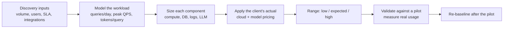

# Cost Estimation - Logistics Operations Copilot

> **No total price is quoted here.** A number produced before discovery would
> be fiction. This document sets out the cost *structure*, the *drivers* and
> the *inputs* needed to produce a defensible estimate with the client.

The prototype in this repository costs nothing to run: it uses no cloud
service, no database and no model API.

---

## 1. Cost categories

| # | Category | What it covers | Prototype | Driver |
|---|---|---|---|---|
| 1 | Compute | API containers (k8s/ECS/Cloud Run) | 0 | Peak concurrent requests, replica count, CPU/memory per replica |
| 2 | Database | Managed PostgreSQL for audit logs, escalations, cached shipments | 0 | Rows/day, retention, instance size, multi-AZ |
| 3 | Vector database | Policy embeddings for RAG (pgvector or managed) | 0 (not used) | Number of chunks, embedding dimensions, query rate |
| 4 | LLM usage | Routing and/or grounded answers | 0 (rule-based) | Queries/day x (input + output tokens) x model price |
| 5 | Embeddings | Initial indexing + re-indexing on document change | 0 | Corpus size, update frequency |
| 6 | Storage | Documents, backups, artefacts | 0 | GB stored, snapshot frequency, retention |
| 7 | Network | Egress, load balancer, gateway, NAT, private links | 0 | Requests/day, payload size, cross-AZ traffic |
| 8 | Logging | Ingestion + retention of audit and application logs | Local file | GB/day ingested, hot vs cold retention |
| 9 | Monitoring | Metrics, traces, dashboards, alerting, APM seats | 0 | Hosts, custom metrics, trace sampling, seats |
| 10 | CI/CD | Build minutes, registry storage, scanning | Free tier | Commits/day, matrix size, image size |
| 11 | Engineering | Discovery, integration, evaluation, hardening, rollout | The POC | Number of integrations, security review depth, data quality |
| 12 | Support | Run-the-service: on-call, incidents, tuning, new phrasings | 0 | SLA tier, coverage hours, query volume |
| 13 | Backup / DR | Backups, cross-region replication, DR exercises | 0 | RPO/RTO targets, data volume |
| 14 | Licences | SSO seats, helpdesk API tier, third-party tooling | 0 | Users, connector tiers |

## 2. What the estimate depends on

An estimate is only as good as these inputs. All of them are **unknown** today
and must come from discovery:

| Input | Why it matters |
|---|---|
| Daily query volume | Drives compute, LLM tokens, log volume - the largest single lever |
| Concurrent users and peak shape | Replica count and instance size are sized for peak, not average |
| Number of integrations (TMS, WMS, ERP, helpdesk, pricing) | Dominates engineering effort; each system means an adapter, mapping, tests and a sandbox |
| Data size (shipments, documents) | Database and vector store sizing, re-index cost |
| Whether an LLM is used at all | Rule-based routing has zero inference cost; LLM answers add per-query cost that scales linearly with volume |
| Model choice and average tokens per query | A large model on long contexts can cost 10-50x a small model on short ones |
| RAG context size and top-k | Directly multiplies input tokens on every query |
| Caching hit rate | Repeated questions served from cache cost nothing in tokens |
| SLA and availability target | Multi-AZ, standby capacity and 24/7 support are step changes, not increments |
| Log and audit retention | Compliance-driven retention can exceed compute cost |
| Cloud provider, region, commitment | List price vs reserved/committed-use discounts |
| Deployment model (cloud, on-prem, air-gapped) | On-prem shifts cost from opex to internal effort and lengthens delivery |
| Security and compliance requirements | Pen tests, audits and certifications are real line items |

## 3. How to build the estimate



1. **Model the workload.** Queries/day, peak QPS, share per intent, tokens per query if an LLM is involved.
2. **Size each component** against that workload with explicit assumptions written down next to every number.
3. **Price with the client's own rate card** - their negotiated cloud and model pricing, not list prices.
4. **Present a range** (low / expected / high) with the assumption that moves each boundary.
5. **Validate in the pilot.** A two-week pilot with real usage replaces every estimate with a measurement.
6. **Re-baseline** after the pilot and quarterly thereafter.

## 4. Cost per query (the metric that matters at scale)

```
cost per query =
      (compute + database + logging + monitoring) / queries
    + LLM input tokens  x input price
    + LLM output tokens x output price
    + retrieval cost (vector search)
```

Levers, in the order worth pulling:

1. **Keep deterministic paths deterministic.** Tracking, delayed lists and pricing need no model - the design already routes them to plain code, so the marginal cost stays near zero regardless of volume.
2. **Cache aggressively.** Policy answers repeat constantly; a cache hit costs nothing.
3. **Right-size the model.** Route simple classification to a small model; reserve larger models for genuinely hard answers.
4. **Trim the context.** Fewer, better chunks beat more chunks on both cost and accuracy.
5. **Tier the logs.** Hot storage for days, cold for compliance retention.

## 5. Timeline estimation (same discipline)

No delivery date is claimed here either. The estimate is built from the phases
in docs/production-readiness.md, and each phase is sized against the *number of
integrations*, the *state of the client's APIs* and the *speed of their security
review* - historically the three things that decide the schedule.

| Factor | Effect on timeline |
|---|---|
| Client API availability and documentation quality | Often the critical path; undocumented or unstable APIs dominate everything else |
| Sandbox environment availability | Integration work cannot start without one |
| Security review and change-approval cycles | Frequently longer than the engineering work |
| Number and quality of policy documents | Drives the RAG track if enabled |
| Availability of operations staff for UAT | Gates the pilot |
| Data quality issues discovered during integration | The most common source of overrun |

The honest position to take with a client: give a range per phase, name the
dependency that would change it, and re-forecast after discovery - when the
inputs above are facts instead of assumptions.
