# Production Readiness - Logistics Operations Copilot

What it takes to move this POC to a production service inside a client's
environment. The prototype requires none of it; nothing here is a hidden
dependency of `python app.py`.

---

## 1. Delivery lifecycle

```mermaid
flowchart LR
    A["Requirement gathering"] --> B["PRD"]
    B --> C["HLD / LLD"]
    C --> D["POC (this repository)"]
    D --> E["Client feedback"]
    E --> F["MVP with real integrations"]
    F --> G["Integration testing"]
    G --> H["Security testing"]
    H --> I["Agent evaluation"]
    I --> J["Performance testing"]
    J --> K["UAT"]
    K --> L["Pilot with one team"]
    L --> M["Production rollout"]
    M --> N["Monitoring"]
    N --> O["Continuous improvement"]
    O --> P["Scale to more teams / regions"]
    O -.-> F
```



| Phase | Exit criteria | Owner |
|---|---|---|
| Requirement gathering | Systems, users, volumes, SLAs and compliance profile documented | FDE + client ops |
| PRD | Scope, assumptions and success metrics signed off | FDE + product |
| HLD / LLD | Architecture, data model, integration and security design reviewed | FDE + client architecture |
| POC | The five question types answered end to end (this repo) | FDE |
| Client feedback | Real employee phrasing captured; gaps listed | FDE + ops team |
| MVP | Real adapters, SSO, persistence, deployed to a non-production environment | Engineering |
| Integration testing | Contract tests green against client sandboxes | Engineering + client IT |
| Security testing | Pen test findings closed, threat model reviewed | Security |
| Agent evaluation | Routing/answer accuracy at or above the agreed bar | FDE |
| Performance testing | p95 latency and throughput meet the SLA under expected load | Engineering |
| UAT | Operations team signs off on real scenarios | Client ops |
| Pilot | One team, limited hours, daily review, rollback ready | FDE + client ops |
| Production | Full rollout with monitoring, alerting and support model live | Everyone |

## 2. Containerisation

```bash
docker build -t fde-logistics-copilot:1.0.0 .
docker run -p 8000:8000 fde-logistics-copilot:1.0.0        # API
docker run -it --rm fde-logistics-copilot:1.0.0 python app.py   # CLI
docker compose up --build                                   # local stack
```

Image properties: slim Python base, dependencies installed in a cached layer,
runs as a non-root user, `HEALTHCHECK` hitting `/health`, logs to a mounted
volume. `.dockerignore` keeps the virtualenv, git history, caches, `.env` and
the docs out of the image. Tags are immutable and semantic (`1.0.0`, plus the
git SHA); `latest` is never deployed to production.

Verified against this build:

| Check | Result |
|---|---|
| Image size | 209 MB (`python:3.12-slim` base) |
| Runtime user | `uid=1000(copilot)` - non-root |
| Docker `HEALTHCHECK` | reports `healthy`; `/health` returns 200 with `environment=docker` |
| CLI inside the image | `python app.py --demo` answers all six demo queries |
| Test suite inside the image | 138 passed |
| API endpoints | tracking, delayed, pricing, policy, escalation, metrics all correct; 404 and 422 paths behave |
| `docker compose up` | container healthy, port 8000 published, `logs/copilot.log` written through to the host |
| Build context hygiene | `.venv`, `.git`, `docs/` and caches absent from the image |

Registry: the client's own registry (ECR / ACR / GCR / Harbor) with image
scanning enabled on push.

## 3. CI/CD

Implemented today (`.github/workflows/ci.yml`):

1. `prototype-stdlib-only` - `python app.py --demo` with no `pip install`, plus a grep for the required escalation phrase.
2. `test` - full suite on Python 3.10, 3.11 and 3.12.
3. `lint` - `ruff check` (non-blocking).

Production pipeline (designed):


No cloud credentials are required for the CI that exists today - a reviewer can
fork and run it immediately.

## 4. Deployment options

| Option | When it fits | Notes |
|---|---|---|
| Kubernetes (EKS/AKS/GKE or on-prem) | Client already runs k8s; multi-service estate | Deployment + HPA + PDB + Ingress + secrets from a CSI driver |
| AWS ECS Fargate | AWS-centric client wanting less operational surface | Task definition + ALB + auto scaling policy |
| Azure Container Apps / Google Cloud Run | Bursty traffic, scale-to-zero acceptable | Simplest operationally; watch cold starts |
| On-prem VMs + systemd | Strict data-residency or air-gapped client | Same container or a virtualenv; manual scaling |

The service is stateless, so all four work without code changes. Choose with
the client's platform team, not by preference.

## 5. Health checks and probes

| Probe | Endpoint | Meaning |
|---|---|---|
| Liveness | `GET /health` | Process is alive; restart if it fails |
| Readiness | `GET /health` (extended in production to check DB and adapter reachability) | Ready to receive traffic |
| Startup | `GET /health` with a longer grace period | Slow first start does not trigger restarts |

Production readiness should verify downstream dependencies (database, TMS
adapter, helpdesk) and report degraded rather than simply failing, so a single
slow dependency does not take the whole copilot offline.

## 6. Scaling

| Dimension | Approach |
|---|---|
| Horizontal | Stateless replicas behind a load balancer; HPA on CPU and request rate |
| Vertical | Small pods (0.25-0.5 vCPU, 512 MB) are enough for rule-based routing |
| Caching | Cache shipment lookups for a short TTL; cache policy retrievals; cache LLM answers for repeated questions |
| Backpressure | Rate limits at the gateway; timeouts and circuit breakers per adapter so a slow TMS cannot exhaust workers |
| Async | Long-running client calls move to async I/O; escalation ticket creation can be queued and retried |
| LLM concurrency | Provider rate limits become the bottleneck once an LLM is added - budget tokens per user and queue overflow |

## 7. Reliability, backup and disaster recovery

| Concern | Design |
|---|---|
| High availability | >= 2 replicas across availability zones; managed multi-AZ database; no single points of failure in the copilot tier |
| Graceful degradation | If the TMS is unreachable the copilot says so and escalates - it never invents a status |
| Backups | Managed PostgreSQL automated backups + point-in-time recovery; audit logs shipped to durable storage |
| RPO / RTO | **Assumption** — RPO 15 min / RTO 1 h are reasonable defaults for an internal assistant; the client must confirm. Carried in the register at docs/PRD.md §23.2 |
| DR test | Restore-from-backup exercise before go-live and at an agreed interval afterwards |
| Rollback | Immutable image tags; previous version redeployable in minutes; database migrations forward-compatible and reversible |

## 8. Observability

| Signal | Prototype | Production |
|---|---|---|
| Logs | `logs/copilot.log`, one JSON record per query | Shipped to CloudWatch / ELK / Splunk / Datadog with request and user IDs |
| Metrics | In-process counters, `/api/v1/metrics` | Prometheus + Grafana or a managed APM: query rate, tool distribution, success rate, p50/p95 latency, escalation rate |
| Traces | None | OpenTelemetry spans across gateway -> API -> adapter -> client system |
| Alerts | None | Success rate below threshold, p95 latency breach, escalation spike, adapter error rate, health check failures |
| Dashboards | CLI `stats` | Ops dashboard: volume by intent, top questions, unanswered questions, escalation reasons |

The "unanswered questions" panel matters most: it is the backlog that tells the
FDE which capability to build next.

## 9. Configuration and secrets

- All configuration through environment variables (`core/config.py`, `.env.example`); no environment-specific code paths.
- Secrets from a secrets manager injected at runtime; never in the image, the repo or a plain `.env` in production.
- Configuration changes are reviewed and versioned like code.
- Feature flags for risky capabilities (LLM router, RAG answers) so they can be switched off without a redeploy.

## 10. Go-live checklist

- [ ] Adapters implemented and contract-tested against the client's sandbox
- [ ] SSO integration verified with real accounts; RBAC matrix signed off
- [ ] TLS end to end; secrets in the secrets manager
- [ ] PII redaction and retention automation active
- [ ] Evaluation set extended with the client's phrasing; accuracy bar met
- [ ] Load test at expected peak; p95 within the SLA
- [ ] Dashboards, alerts and on-call routing configured
- [ ] Runbooks written: adapter outage, wrong answer report, escalation backlog
- [ ] Rollback rehearsed; DR restore tested
- [ ] Pilot team trained; feedback channel open
- [ ] Support model and SLA agreed and documented
